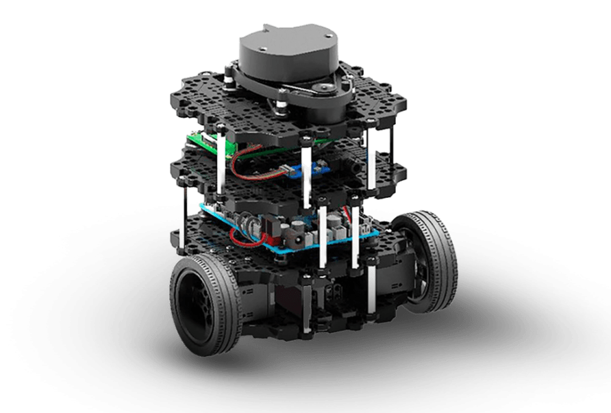
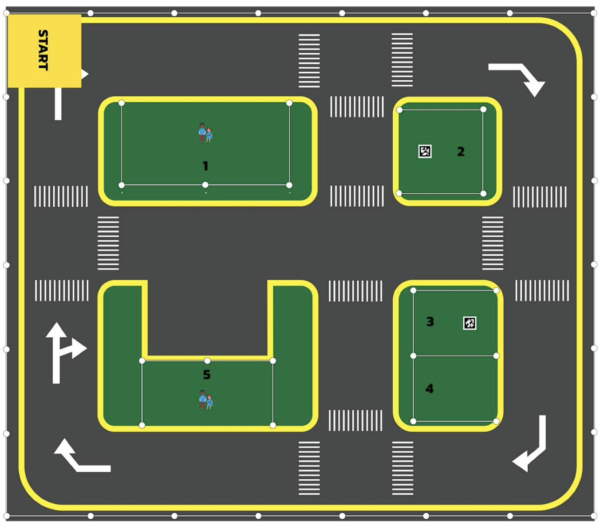

# RobotKub TurtleBot3 -- WRG Thailand 2026 (ROS League)

[](https://github.com/robotkub/turtlebot3/actions/workflows/vision-tests.yml)


Our team's software for the **ROS League / TurtleBot** event at the WRG Thailand
Championship   a **TurtleBot3 Burger** running the arena mission **fully
autonomously**, no remote control once it starts.


<p align="center"> 

## Start here: the tutorial series

**New to this project? Don't start with this README**  start with the guided,
step-by-step tutorial (8 chapters, no prior ROS2 assumed), in Thai and English.
This README is just the quick reference.

- **ภาษาไทย: [`docs/th/00-index.md`](docs/th/00-index.md)**
- **English: [`docs/en/00-index.md`](docs/en/00-index.md)**

## What the robot has to do



The arena is a city of yellow roads with crosswalks, a **START** box (top-left),
and five green zones. The mission, in order:

1. **Drive out from START** and navigate the roads (using a map it built earlier).
2. **Detect and dispense immediately**:
   - See an **AprilTag** in one of the tag zones (zones **2** or **3**) → dispense
     that tag's number of boxes right away.
   - See a **"victim" sign** (human figure in zones **1** or **5**) without a tag →
     drive up to it and dispense **1 box**.
3. **Return to START** before time runs out.

## What the robot detects

| ✅ Victim sign — a person, dispense 1 box here | ❌ Not a person — ignored | 🔢 AprilTag — dispense that tag's count |
|:---:|:---:|:---:|
|  |  |  |
| The victim sign is a **human figure**. Seeing it triggers an immediate 1-box dispense (after walking up to it). | The arena, tags and empty road aren't people — the detector leaves them alone (no false trigger). | A 36h11 tag; its number (here **3**) is how many boxes to drop immediately upon sighting. |

How the detectors work, and how to tune them: [docs chapter 6](docs/en/06-vision.md).

## Learning objectives

This project is also how the team **learns ROS2**. Work through it and you should
be able to:

- Use **git** (clone / pull / commit / push) to maintain the team's code
- Understand **Navigation**  SLAM, AMCL, Nav2  and how our mission code drives it
- Understand **Vision**  reading the AprilTag and finding the victim sign (a human figure) with a person detector
- Flash and understand the **OpenCR firmware** (why the buttons are customized)
- Use **Foxglove** to see what the robot sees and drive it from a laptop
- Run the **full mission end-to-end**, in both debug and competition mode

## Running things

Zero-to-mission, in order. Do this once per robot/arena; after that, just the
last two commands (mission launch) for every practice run. Only one shell
script in the whole flow (the installer)  everything else is `ros2 launch`
or a `ros2 service call`. Detail for every step is linked inline; the
[tutorial](#start-here-the-tutorial-series) walks through each with pictures.

**1. Clone the repo** (on both the Pi and your laptop):
```bash
git clone https://github.com/robotkub/turtlebot3.git ~/turtlebot3_ws
```

**2. Flash the OpenCR firmware** (on the Pi, OpenCR connected by USB)  our
custom build, so the buttons don't test-drive the robot (see
[chapter 4](docs/en/04-opencr.md)):
```bash
cd ~/turtlebot3_ws/firmware/opencr
./flash_opencr.sh                # auto-detects the port
```

**3. Run the installer** on the **Pi only** — laptops use Docker instead
([chapter 2](docs/en/02-install.md)):
```bash
cd ~/turtlebot3_ws/scripts
chmod +x install-humble-turtlebot3.sh
./install-humble-turtlebot3.sh
```

**4. Build a map** of the arena (once per layout  robot base must be up on
the Pi first; auto-saves on Ctrl-C, see [chapter 5](docs/en/05-navigation.md) & [chapter 9](docs/en/09-compute-pc.md)):
```bash
# on the Pi -- leave it running (the zenoh router is already a systemd service)
ros2 launch turtlebot3_bringup robot.launch.py
```
```bash
# on your laptop -- no native ROS2 install needed, it all runs in Docker
# (nothing to configure: .env is committed, and finds the robot as skuba.local)
./ttb3 build            # once, and again after each git pull
./ttb3 map              # SLAM + Foxglove + auto-saver
./ttb3 teleop           # keyboard driving, in a SECOND terminal
```
Joystick teleop is already inside `./ttb3 map` (muxed onto `/cmd_vel` by
`twist_mux`, joy beating keyboard); only the keyboard needs its own terminal,
because `ros2 launch` can't hand a bundled node the real TTY it requires.

No robot sensors handy? `./ttb3 record` captures a session and `./ttb3 replay`
plays it back through the **whole** stack — bag, Nav2 and Foxglove from that
one command. The Pi still has to be powered **on** (its zenoh router carries
the traffic) but nothing needs to be plugged into it.

**5. Save the START pose** - `/save_start_pose` is hosted by `mission_manager`,
which only exists once `debug.launch.py`/`competition.launch.py` is running
(**not** the standalone `navigation.launch.py` in step 6 -- that one doesn't
start `mission_manager` at all). So bring up the full stack first, **on the
Pi**:
```bash
ros2 launch ttb3_bringup debug.launch.py
```
AMCL self-localizes at (0, 0, 0) on startup (`set_initial_pose` in
`config/nav2_params.yaml`), which is the START box — slam_toolbox's map origin
is wherever the robot stood when mapping began. So the map appears in Foxglove
straight away; you do **not** normally need the pose-estimate tool. If
localization ever drifts badly, nudge it with the pose-estimate arrow tool in
Foxglove's 3D panel, or from the CLI:
```bash
ros2 topic pub -1 /initialpose geometry_msgs/msg/PoseWithCovarianceStamped \
  '{header: {frame_id: "map"}, pose: {pose: {position: {x: 0.0, y: 0.0, z: 0.0}, orientation: {x: 0.0, y: 0.0, z: 0.0, w: 1.0}}}}'
```
Then drive/place the robot exactly on the START box, confirm it's well
localized (laser scan lines up with the map walls in Foxglove), and:
```bash
ros2 service call /save_start_pose ttb3_msgs/srv/SaveStartPose
```
From then on, `reset_to_start` re-publishes this saved pose automatically.

> **Import the Foxglove layout** (`config/foxglove_layout_nav.json`, Layout
> panel → Import from file) before using the goal/pose tools. Foxglove's stock
> "Default" layout publishes goals to `/move_base_simple/goal` — the ROS 1
> name, which Nav2 does not listen on, so clicking "publish goal" silently
> does nothing. Our saved layout points at `/goal_pose` and `/initialpose`.
>
> Use the **web** app (<https://app.foxglove.dev>) or a current desktop build:
> `foxglove_bridge` 3.4.x speaks the newer `foxglove.sdk.v1` websocket
> subprotocol and rejects the legacy `foxglove.websocket.v1` outright (verified
> — a handshake offering only the old one gets `400 Bad Request`), so a
> long-outdated Studio will fail to connect for reasons that look like a
> network problem.

**6. Run navigation standalone** (optional -- only for tuning Nav2 by itself;
skip straight to step 7 for normal practice runs, which already includes
this):
```bash
./ttb3 nav
```
Same as mapping: joystick teleop + `twist_mux` come up alongside Nav2 (keyboard
still needs its own separate terminal, see step 4), so you can grab manual
control at any moment and it immediately overrides autonomous driving
(joy > keyboard > Nav2 priority). No `mission_manager` here, so no
`/save_start_pose` -- that's step 5, against `debug.launch.py`.

**7. Run the mission**:
```bash
ros2 launch ttb3_bringup debug.launch.py         # practice/tuning
ros2 launch ttb3_bringup competition.launch.py   # the real run
```

**Never practice with the competition launch, never compete with the debug
one** - see [docs chapter 7](docs/en/07-run-mission.md). Full launch-arg
reference: [`src/ttb3_bringup/README.md`](src/ttb3_bringup/README.md).

### If something looks broken

Each of these cost us real debugging time and fails in a way that points
somewhere else entirely — `./ttb3` exists mostly to make the first three
impossible to get wrong:

| Symptom | Cause |
|---|---|
| Foxglove stuck on "Waiting for connection…" | `docker compose run` publishes **no** ports without `--service-ports`; the bridge is running fine, nothing is forwarding 8765 |
| `required variable ROBOT_IP is missing` — even on `build` | `docker-compose.yml` needs `ROBOT_IP` just to *parse*. A failed `build` then leaves you silently running a stale image |
| Robot unreachable after it moved networks | Its IP is DHCP and changes. Use the name `skuba.local` (mDNS, set up by the installer), not a hardcoded address |
| Everything starts, but nothing ever localizes, and the map never appears | AMCL has no pose, so there's no `map` frame for Foxglove to draw in. Fixed by `set_initial_pose`; if you disable that, you must send `/initialpose` yourself |
| "Publish goal" in Foxglove does nothing | You're on Foxglove's stock layout, which posts to the ROS 1 `/move_base_simple/goal`. Import `config/foxglove_layout_nav.json` |
| `termios.error: Inappropriate ioctl` from teleop | `teleop_keyboard` was launched by `ros2 launch`, which can't give it a real TTY. Run it on its own: `./ttb3 teleop` |
| Nav2 nodes hang at startup during a bag replay | No `/clock` yet. Replay needs `--clock` **and** `use_sim_time:=true`; `./ttb3 replay` does both |

## Packages

| Package | What it is |
|---|---|
| `ttb3_msgs` | Custom message/service definitions shared by everything else |
| `ttb3_perception` | `apriltag_detector` (reads the number tag) + `victim_detector` (finds the victim sign -- a human figure -- with a MobileNet-SSD person detector) |
| `ttb3_dispenser` | `dispenser_controller` -- drops the boxes (mock backend until the real hardware is wired up) |
| `ttb3_mission` | `mission_manager` (the "brain" -- the mission state machine) + `button_handler` (the two OpenCR buttons) |
| `ttb3_bringup` | Launch files, Nav2 wiring, Foxglove config, `map_autosaver` |

The OpenCR firmware (flashed to the board, not a ROS package) lives in
[`firmware/opencr/`](firmware/opencr/).

## More

The tutorial is the real documentation; the detail for everything below lives there:

- Install & build -> [chapter 2](docs/en/02-install.md)
- OpenCR firmware (one-command flash) -> [chapter 4](docs/en/04-opencr.md)
- Navigation (SLAM / AMCL / Nav2) -> [chapter 5](docs/en/05-navigation.md)
- Vision + the **tests / CI** -> [chapter 6](docs/en/06-vision.md)
- Debug vs. competition mode, the buttons, servo, checklist -> [chapter 7](docs/en/07-run-mission.md)
- Foxglove -> [chapter 8](docs/en/08-foxglove.md)
- Laptop Docker compute offload -> [chapter 9](docs/en/09-compute-pc.md)
- Glossary of terms -> [index](docs/en/00-index.md#glossary)
