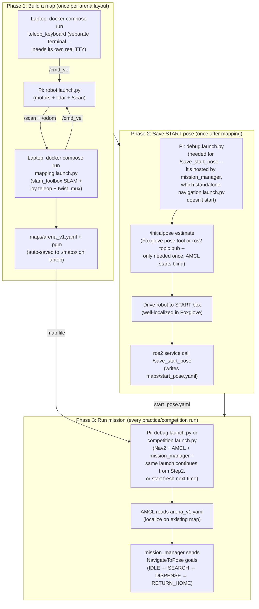

← [4. OpenCR + Custom Firmware](04-opencr.md) | [Back to index](00-index.md) | Next: [6. Understanding Vision →](06-vision.md)

# 5. Understanding Navigation

## Basic vocabulary first

| Term | Plain-English meaning |
|---|---|
| **Node** | One small program that does one job, talks to others via topics |
| **Topic** | A named channel a node can publish (speak) to or subscribe (listen) to, e.g. `/cmd_vel` |
| **TF** | The system that answers "where is this point relative to that one," e.g. where the camera sits relative to the robot body |
| **`/odom`** | The robot's position as estimated from how much the wheels have turned (drifts if wheels slip) |
| **`/map`** | The arena map that's already been built |
| **SLAM** | Building a map AND figuring out where you are on it, at the same time (used when there's no map yet) |
| **AMCL** | Figuring out where you are on a map you **already have** (faster/more reliable than SLAM if the map doesn't change) |
| **Nav2** | Plans a path and drives there on its own, avoiding walls, once you give it a destination |

## The layers (bottom to top)

1. **OpenCR firmware** -- publishes `/odom`, `/imu`, `/scan` (lidar), `/sensor_state`; subscribes `/cmd_vel`
2. **ROS2** -- the messaging layer that lets every node talk to every other node
3. **Nav2 + SLAM/AMCL** -- off-the-shelf packages (we didn't write these) that we configure to work with our robot
4. **Our own code** -- `mission_manager` is the one telling Nav2 "go here" via the `NavigateToPose` action

Layer 3 (Nav2 itself) is a whole system of its own -- costmaps, planners,
controllers, recovery behaviors -- all talking to each other. This is the
official architecture diagram from the [Nav2 project](https://docs.nav2.org/)
(we don't maintain Nav2, just configure it):


Our `config/nav2_params.yaml` ([below](#tuning-nav2)) is what tunes the boxes
in this diagram (costmap layers, planner/controller plugins) for our robot.

## The navigation pipeline — big picture



No shell scripts. The mapping launch **auto-saves the map to disk continuously
and again when you kill it**, so there's no separate "save" step: drive
around, then Ctrl-C when it looks done.

```bash
# terminal 1 (Pi) -- robot's own senses + motors. Leave running.
ros2 launch turtlebot3_bringup robot.launch.py

# terminal 2 (laptop) -- SLAM (slam_toolbox) + Foxglove bridge + the auto-saver
# + joy teleop (bundled in, muxed onto /cmd_vel via twist_mux). All laptop
# commands run inside Docker -- no native ROS2 install needed. ./ttb3 finds
# the robot by name (skuba.local) and passes the flags that fail silently
# when forgotten.
./ttb3 map

# terminal 3 (laptop) -- keyboard driving, in its own terminal on purpose:
# ros2 launch manages child processes through pipes and can't give
# teleop_keyboard the raw TTY it needs to read keystrokes (it crashes with
# termios.error if you try to bundle it into terminal 2's launch instead).
./ttb3 teleop
```
Joy outranks keyboard if you use both (`twist_mux`, see
[`ttb3_bringup/README.md`](../../src/ttb3_bringup/README.md)).

Open Foxglove Studio at `ws://localhost:8765` to watch the map grow; when
the map has no black (unknown) areas left inside the walls,
just **Ctrl-C terminal 2**. `arena_v1.yaml` + `arena_v1.pgm` are already saved
in `./maps/` on your laptop (the volume mount writes them to the host
filesystem). The auto-saver also rewrites them every ~15 s while running, so a
crash never loses your progress.

More detail: [`../../maps/README.md`](../../maps/README.md)

## Capturing the START pose

The START pose (where the robot begins and returns to) lives in **one
file**: `maps/start_pose.yaml`. Everything reads it, so you set it once.

`/save_start_pose` is hosted by `mission_manager`, which only exists once
`debug.launch.py` (or `competition.launch.py`) is running -- **not** the
standalone `navigation.launch.py` from the previous section, which doesn't
start `mission_manager` at all. So bring up the full stack first, on the Pi:

```bash
ros2 launch ttb3_bringup debug.launch.py
```

AMCL starts with no idea where the robot actually is. If Foxglove's map view
looks offset from where the robot really is, give it a rough estimate first
-- either the pose-estimate arrow tool in Foxglove's 3D panel (drag on the
map), or from the CLI:

```bash
ros2 topic pub -1 /initialpose geometry_msgs/msg/PoseWithCovarianceStamped \
  '{header: {frame_id: "map"}, pose: {pose: {position: {x: 0.0, y: 0.0, z: 0.0}, orientation: {x: 0.0, y: 0.0, z: 0.0, w: 1.0}}}}'
```

Then drive/place the robot exactly on the START box, make sure it's well
localized (lidar lines up with the map in Foxglove), and:

```bash
ros2 service call /save_start_pose ttb3_msgs/srv/SaveStartPose
```

That writes the robot's current AMCL position into `maps/start_pose.yaml`.
`mission_manager` re-reads the file every time it needs START, so the change
takes effect immediately — no rebuild. (You can also hand-edit the file.)
From then on, `reset_to_start` re-publishes this saved pose automatically --
the manual `/initialpose` estimate above is only needed once, the very first
time (or again later if localization ever drifts badly).

## How navigation works during an actual mission run

`ttb3_bringup`'s `debug.launch.py`/`competition.launch.py` include
`navigation.launch.py`, which starts Nav2 against the saved map
(`maps/arena_v1.yaml` by default, override with `map:=...`). This mode uses
**AMCL** (not SLAM) since the map already exists -- no need to rebuild it every
run.

You can also bring up navigation on its own to test/tune it:

```bash
# Docker on laptop (the only laptop path)
./ttb3 nav
```

### Tuning Nav2

The team's tunable Nav2 parameters are a project-local copy at
[`src/ttb3_bringup/config/nav2_params.yaml`](../../src/ttb3_bringup/config/nav2_params.yaml)
(loaded by default). Edit **this** file, not the stock TurtleBot3 one. Common
things to tune: costmap `inflation_radius` (how far to stay off walls),
controller max velocities (speed), planner tolerance. Rebuild the workspace
after editing so the installed copy updates.

## Where our code plugs into Nav2

Main file: `src/ttb3_mission/ttb3_mission/mission_manager.py`

- **IDLE**: boots here — armed but stationary. Waits for a start signal (SW1 on
  the robot, or `/mission_start`) before doing anything.
- **SEARCH**: visits zones one at a time, in order (from `maps/mission_zones.yaml`
  -- see [Chapter 7](07-run-mission.md)) via Nav2's `NavigateToPose` action.
  Arriving at a zone with nothing to see just moves on to the next one; seeing
  a tag or victim dispenses immediately, then continues to the next zone --
  `RETURN_HOME` only once every zone has been visited
- **RETURN_HOME**: sends a goal back to the START pose (read from
  `maps/start_pose.yaml`)
- **Stuck watchdog**: checks `/odom` for real position movement over the last
  10 seconds; if there's been none (stuck on a wall / wheels spinning free),
  it cancels the goal and stops instead of pushing forever
- **`reset_to_start` service**: republishes `/initialpose` at the START pose
  (only corrects what AMCL believes -- doesn't erase any progress/score already
  made). Call it from Foxglove, the CLI, or the `reset_pose` alias.

## Try it yourself

1. Launch debug mode (`ros2 launch ttb3_bringup debug.launch.py`) and watch `/mission_status` in Foxglove as the state changes
2. Try sending a manual goal: `ros2 topic pub -1 /initialpose ...` (reset the believed starting position)
3. Try pressing SW1/SW2 for real (or fake `/sensor_state` with `ros2 topic pub`) and watch the state change as expected

Ready? Move on to [Chapter 6: Understanding Vision](06-vision.md).

---
← [4. OpenCR + Custom Firmware](04-opencr.md) | [Back to index](00-index.md) | Next: [6. Understanding Vision →](06-vision.md)
