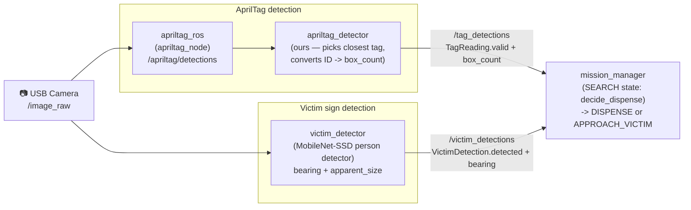
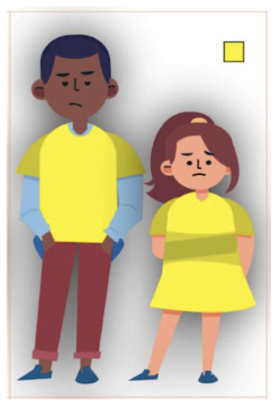
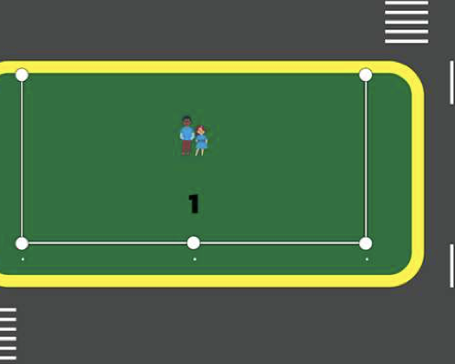

<- [5. Understanding Navigation](05-navigation.md) | [Back to index](00-index.md) | Next: [7. Running the real mission ->](07-run-mission.md)

# 6. Understanding Vision

The robot needs to see two things: **the number on the AprilTag** (how many
boxes to drop) and **the victim sign** (the human-shaped sign it has to stand
in front of before dispensing).

## Basic vocabulary

| Term | Plain-English meaning |
|---|---|
| `/image_raw` | The raw camera feed, frame by frame |
| `/image_raw/compressed` | The same feed, JPEG-compressed — used over WiFi so it doesn't consume bandwidth |
| `/camera_info` | The camera's calibration data (lens distortion etc.) |
| AprilTag | A black-and-white barcode-like marker a camera can read reliably even at an angle |

## Perception pipeline — overview



What the detectors actually see — examples from the test suite:

| AprilTag (tag ID 3 -> 3 boxes) | Victim sign (human figure -> 1 box) | Not a person (rejected) |
|:---:|:---:|:---:|
|  |  |  |

## AprilTag — reading the number

We didn't write a detector from scratch — we use the off-the-shelf
`apriltag_ros` (already installed via apt) and wrap a thin layer around it:

```text
camera --/image_raw--> apriltag_ros (apriltag_node) --/apriltag/detections--> apriltag_detector (ours) --/tag_detections--> mission_manager
```

`apriltag_detector` (`src/ttb3_perception/ttb3_perception/apriltag_detector.py`) just:
- Picks the closest tag (largest area in frame) if more than one is visible.
- Converts **tag ID directly into box_count** (tag #3 = drop 3 boxes; the offset/max are adjustable params).
- Publishes `valid: false` if no tag has been seen recently.

**What actually needs tuning**: `src/ttb3_perception/config/tags_36h11.yaml` -> `size:`
(the tag's black-square edge length in meters — measure the real printed tag
and set this correctly; it affects pose accuracy, not ID reading)

## Victim detector — finding the human figure

The victim sign is a **human figure**, so we detect it *as a person* — not by
its colour. We run a small neural network, **MobileNet-SSD** (a person/object
detector), through OpenCV's `dnn` module:

1. Feed the camera frame to the network (`cv2.dnn`).
2. Keep the highest-confidence **person** box above `confidence_threshold`.
3. Compute, from that box:
   - `bearing`: the box's center vs. the image's center (left/right) — used to steer toward it.
   - `apparent_size`: box area / image area — a distance proxy (bigger = closer).

Why a DNN and not colour? The sign might not be a fixed colour, and "is this a
person" is exactly what the sign is. We tried a colour threshold and an OpenCV
HOG people-detector first — colour is fragile (lighting), and HOG (trained on
real photos) is unreliable on cartoon/illustrated figures. The DNN detects the
cartoon sign reliably and never fires on the arena/tags/background.

Code: `src/ttb3_perception/ttb3_perception/victim_detector.py` (the pure
detection function is `detect_person` in `vision_core.py`). The model ships in
`src/ttb3_perception/models/` (MobileNet-SSD, VOC `person` class).

**What actually needs tuning**: `src/ttb3_perception/config/victim_detector.yaml`
-> `confidence_threshold`. Raise it if you get false detections at the venue,
lower it if it misses the sign. No colour to tune.

## How mission_manager uses this

Dispense triggers immediately from the `SEARCH` state based on what's currently
visible (see [Chapter 7](07-run-mission.md) for the full rule table):

- **Tag seen**: dispense `tag.box_count` immediately (no approach walk for tags —
  the tag gives a count but no bearing/proximity to servo on).
- **Victim seen (no tag)**: enter `APPROACH_VICTIM`. During this state,
  `bearing`/`apparent_size` drive `/cmd_vel` directly (no Nav2 goal needed) —
  turning toward the sign and driving closer until `apparent_size` hits the
  target (`approach_close_size`) and it's centered enough
  (`approach_center_tolerance`), then stopping and dispensing 1 box.
- Tune both thresholds in `config/mission_params.yaml`.

## Tests / CI

Every push runs the **vision tests** on GitHub Actions
([`.github/workflows/vision-tests.yml`](../../.github/workflows/vision-tests.yml)):
the AprilTag reader must return the right number, and the victim detector must
find the **person** in many cartoon-people images (the real reference art plus
composited scenes of a figure on varied backgrounds) **without** false-triggering
on non-human scenes (the arena, tags, blank/coloured backgrounds) — while each
image is randomly rotated, tilted, viewed from a camera angle, and re-exposed
(AprilTags are checked at an angle too). They're ROS-free (OpenCV + numpy +
pupil-apriltags), so they run fast without a ROS install. The detection logic
lives in
[`vision_core.py`](../../src/ttb3_perception/ttb3_perception/vision_core.py). Run
them locally:

```bash
pip install -r src/ttb3_perception/test/requirements-test.txt
pytest src/ttb3_perception/test/test_vision.py -v
```

## Try it yourself

1. Launch debug mode and watch `/image_raw` (and `/victim_detections`) in Foxglove.
2. Try publishing a fake `/apriltag/detections` with `ros2 topic pub` and check `apriltag_detector` converts it to the right `box_count`.
3. Hold a cartoon person / the victim sign in front of the camera and watch `/victim_detections` flip to `detected: true`.

Ready? Move on to [Chapter 7: Running the real mission](07-run-mission.md).

---
<- [5. Understanding Navigation](05-navigation.md) | [Back to index](00-index.md) | Next: [7. Running the real mission ->](07-run-mission.md)
