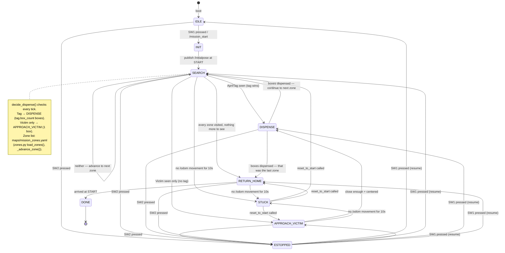

← [6. Understanding Vision](06-vision.md) | [Back to index](00-index.md) | Next: [8. Foxglove →](08-foxglove.md)

# 7. Running the Real Mission

## debug.launch.py vs. competition.launch.py

| | debug.launch.py | competition.launch.py |
|---|---|---|
| Used for | Practice / tuning / debugging | Actual competition runs only |
| Camera stream to laptop? | Yes (compressed) | No -- off entirely |
| Foxglove? | Yes | No |
| Network | Ethernet cable, static IP | WiFi only (unique `ROS_DOMAIN_ID`) |

**Never practice with the competition one, never compete with the debug
one** -- streaming video eats the WiFi bandwidth the robot needs for its own
navigation. Losing that mid-run can freeze the robot and force a restart
(costing the bonus points).

## Mission state machine



## Testing today (no OpenCR/camera attached yet)

> [!IMPORTANT]
> Both launches below run **on the Pi**, over SSH (`ssh skuba@skuba.local`).
> They are not laptop commands -- the laptop has no native ROS 2 at all, only
> Docker, so `ros2` isn't even on its PATH. `./ttb3` is the laptop-side tool,
> and it has no `debug`/`competition` command precisely because these belong
> on the robot.

If the hardware isn't fully assembled yet, you can still test the software alone:

```bash
# on the Pi
ros2 launch ttb3_bringup debug.launch.py with_robot_base:=false with_camera:=false
```

This brings up Nav2 + all 5 mission nodes (dispenser in mock mode) + the
Foxglove bridge, so you can verify everything is wired correctly before the
chassis is fully assembled.

## Hardware assembled -- running for real

```bash
# on the Pi -- practice / tuning
ros2 launch ttb3_bringup debug.launch.py

# on the Pi -- actual competition run
ros2 launch ttb3_bringup competition.launch.py
```

For the full list of other overridable args (map, params_file,
use_mock_hardware, etc.), see [`../../src/ttb3_bringup/README.md`](../../src/ttb3_bringup/README.md).

## Starting, stopping, resuming — the buttons

The robot boots into **IDLE**: armed, but it will not move until you tell it to.
Control is the two OpenCR buttons (this needs the custom firmware from
[Chapter 4](04-opencr.md) — stock firmware would test-drive the robot instead):

| Button | When | Does |
|---|---|---|
| **SW1** | in IDLE | **START** the mission |
| **SW1** | after an e-stop | **RESUME** (clear the e-stop) |
| **SW2** | any time | **E-STOP** — stop now, cancel navigation |

Re-localizing to START is no longer a button — it's the `/reset_to_start`
service (call it from the CLI, the `reset_pose` alias, or a Foxglove Service
Call panel — see [Chapter 8](08-foxglove.md)).

While bench-testing without the buttons, you can start the mission by hand:

```bash
ros2 topic pub --once /mission_start std_msgs/msg/Empty "{}"
```

## Dispense rule — what triggers what

From the `SEARCH` state, `mission_manager` checks every tick for a detection
**immediately** (no "wait for both" logic):

| What's seen | Next state | Boxes dispensed |
|---|---|---|
| **AprilTag** (valid) | `DISPENSE` (directly) | `tag.box_count` (tag ID number) |
| **Victim sign** (human figure, no tag) | `APPROACH_VICTIM` → `DISPENSE` | **1** (after walking up) |
| Neither | Stay in `SEARCH` | — (move on to the next zone) |

Tag takes priority over victim if both are somehow seen at once (shouldn't
happen per arena layout, but the check is deterministic).

A dispense doesn't end the run. `mission_manager` visits every zone listed in
`maps/mission_zones.yaml`, in order (see [Chapter 5](05-navigation.md)) --
arriving at a zone with nothing to see just moves on, and a dispense also
continues to the next zone afterward. `RETURN_HOME` only happens once every
zone on the list has been visited.

## Opening Foxglove to watch the robot

Foxglove has its own chapter now — see **[Chapter 8: Foxglove](08-foxglove.md)**
for connecting, importing the layout, and calling services. Quick version: the
bridge starts with `debug.launch.py`; open <https://app.foxglove.dev> and
connect to `ws://<PI_IP>:8765`.

Foxglove is the only visualizer this project uses. **Foxglove is
never used during an actual competition run** (see the table above).

## Wiring the servo dispenser

The dispenser is a hobby servo on the **Pi's GPIO** (not OpenCR). Convention:
**0° = hold** (gate closed, cube held), **180° = shoot** (launch one cube). One
box = one hold→shoot→hold cycle.

| Servo wire | Connect to Pi | Notes |
|---|---|---|
| Signal (usually orange/white) | **GPIO18 = physical pin 12** | hardware-PWM pin; change with the `gate_pin` param if needed |
| Power (red) | 5 V (physical pin 2 or 4) | a small SG90 can run off the Pi; a bigger servo needs an **external 5 V supply** |
| Ground (brown/black) | GND (physical pin 6) | if using external 5 V, tie its GND to the Pi's GND (common ground) |

Then flip the dispenser to real hardware: `use_mock_hardware:=false` (angles and
timing are the `hold_angle` / `shoot_angle` / `settle_time_sec` params — see the
[bringup README](../../src/ttb3_bringup/README.md)).

## Pre-competition checklist

- [ ] `ROS_DOMAIN_ID` changed to a unique number (see [Chapter 2](02-install.md), ROS_DOMAIN_ID section)
- [ ] Custom OpenCR firmware flashed so SW1/SW2 don't test-drive the robot ([Chapter 4](04-opencr.md))
- [ ] A real arena map has been saved (`maps/arena_v1.yaml`), not a placeholder
- [ ] START pose captured with `/save_start_pose` (drive to START, call it) — `maps/start_pose.yaml` is real, not the default
- [ ] `maps/mission_zones.yaml` zones match the real arena's tag/victim locations
- [ ] Victim sign (a human figure) reliably detected -- tune `confidence_threshold` in `config/victim_detector.yaml` if needed
- [ ] The real AprilTag size has been measured and set in `config/tags_36h11.yaml`
- [ ] Servo wired to GPIO18, `use_mock_hardware:=false`, hold/shoot angles verified to drop exactly one cube
- [ ] SW1 (start/resume) / SW2 (e-stop) tested against real hardware
- [ ] `competition.launch.py` run through a full end-to-end test at least once before the real thing

All checked? You're ready to compete. Back to the [table of contents](00-index.md).

---
← [6. Understanding Vision](06-vision.md) | [Back to index](00-index.md) | Next: [8. Foxglove →](08-foxglove.md)
