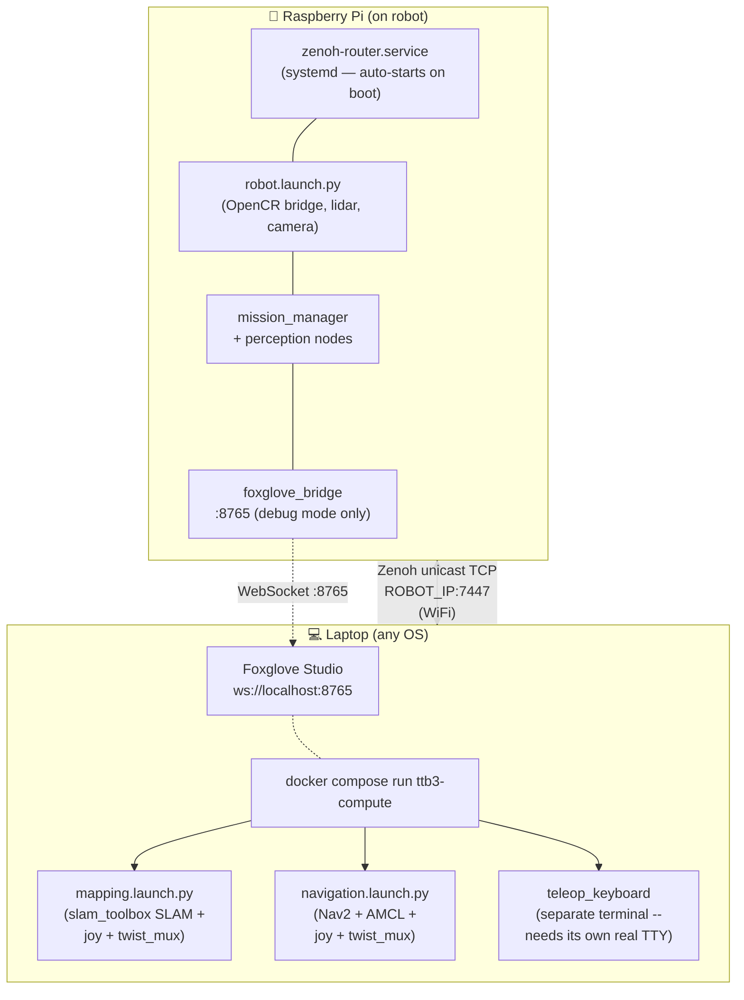

← [8. Foxglove](08-foxglove.md) | [Back to index](00-index.md)

# 9. Laptop Compute via Docker (the Only Laptop Path)

The Raspberry Pi 3 B+ (quad-core ARM Cortex-A53 @ 1.4 GHz, 1 GB RAM) on the robot is resource-constrained. While it handles base motor control, sensors, perception, and mission logic well, running heavy SLAM (slam_toolbox) and Nav2 localization/planning alongside everything else during mapping and tuning can strain its resources.

Laptop teammates offload this compute to a Docker container — **no native ROS 2
installation is needed or wanted on the laptop**. Docker makes the workflow
OS-agnostic: the same commands work on macOS, Windows, and Linux, so no one
has to fight `apt` or manage a separate ROS2 install on their personal machine.

> [!IMPORTANT]
> **Debug/Testing Only!**
> This offloading path is for **mapping, tuning, and debug testing only**. During the actual competition run, `competition.launch.py` runs on the Pi completely standalone and autonomous (competition WiFi is shared with 6-7 other teams, so the run must not depend on a laptop link).

---

## Architecture Overview

- **Physical Topology**: 2 physical machines — Raspberry Pi (on robot) + Laptop.
- **Laptop Environment**: Runs ROS 2 Humble containerized via Docker (`ttb3-compute`). **No bare-metal ROS 2 installation needed or wanted on the laptop.**
- **Networking / RMW**: Uses **Zenoh** (`rmw_zenoh_cpp`), not CycloneDDS. A zenoh router runs on the Pi; the laptop container connects to it over plain **unicast TCP** (`ROBOT_IP:7447`), not multicast discovery.
  > [!IMPORTANT]
  > We switched away from CycloneDDS because its UDP multicast discovery does not work through Docker Desktop on Mac/Windows — `network_mode: host` there is *not* a real host network (Docker Desktop runs containers inside a VM), so multicast never reaches the robot even though it looks like it should. Zenoh's explicit unicast connect sidesteps this entirely; see `docker/zenoh_client_config.json5.template`.
- **Visualization**: Handled via Foxglove Bridge (`visualize:=true`) bundled into the launch files (connecting via WebSocket on `ws://localhost:8765`). Foxglove is the only visualizer used in this project.



---

## One-Time Setup

**Nothing to configure.** `./ttb3` reads `ROS_DOMAIN_ID` from the committed
`.env` and resolves the robot by name (`skuba.local`) to IPv4 on every run, so
a DHCP change breaks nothing. Build the image once and you're done:

```bash
./ttb3 build
```

`./src` is **mounted** into the container, and the image is built with
`--symlink-install`, so launch files, YAML params and the Python nodes are
live — edit on the host and the next `./ttb3 nav` picks it up. You only need
to rebuild when `ttb3_msgs` interfaces change, a new node entry point is
added, or the Dockerfile's apt list changes.

That compiles `ttb3_bringup` into a headless ROS 2 Humble image with
slam_toolbox, Nav2, Foxglove Bridge, TurtleBot3 teleop and Zenoh.

<details>
<summary>The raw <code>docker compose</code> form, for reference</summary>

Export both variables in the shell you run every `docker compose` command
from. `docker-compose.yml` needs `ROBOT_IP` just to *parse*, so `build` needs
it too -- without it `build` fails with "required variable ROBOT_IP is missing
a value" and the image silently stays stale.

`ROBOT_IP` must be a **literal IPv4 address**, never `skuba.local`: it goes
into an unbracketed `tcp/${ROBOT_IP}:7447`, which can't express the IPv6 a
`.local` name answers with first. Get it with `hostname -I` on the Pi.

```bash
export ROS_DOMAIN_ID=42
export ROBOT_IP=<pi's current ipv4>
docker compose build
```

</details>

---

## Workflow 1: Building a Map (slam_toolbox + Map Autosaver)

1. **On the Pi**: nothing. `ttb3-hardware.service` and the zenoh router both
   start on boot, so the base and lidar are already up. Launching it again by
   hand would put a second `turtlebot3_node` on `/dev/ttyACM0`.

2. **On your Laptop**: Launch slam_toolbox mapping inside Docker:
   ```bash
   ./ttb3 map
   ```
   It prints which robot it found (`robot: skuba.local -> 192.168.1.x`) before
   starting. The raw equivalent, if you exported the variables yourself:
   ```bash
   docker compose run --rm --service-ports ttb3-compute \
     ros2 launch ttb3_bringup mapping.launch.py map_path:=arena_v1 visualize:=true
   ```

3. **Visualize & Drive**:
   - Open Foxglove Studio (`ws://localhost:8765`) to view the map building in real time.
   - A joystick/gamepad comes up automatically inside `mapping.launch.py` (Linux hosts only -- Docker Desktop on Mac/Windows doesn't pass through `/dev/input`), muxed onto `/cmd_vel` via `twist_mux`.
   - For keyboard driving, run `teleop_keyboard` in its **own separate terminal** -- it needs raw control of a real TTY to read keystrokes, and `ros2 launch` can't provide that to a bundled child process (confirmed: it crashes with `termios.error` if you try):
     ```bash
     docker compose run --rm ttb3-compute ros2 run turtlebot3_teleop teleop_keyboard \
       --ros-args -r cmd_vel:=cmd_vel_teleop
     ```
     (The `stdin_open: true` / `tty: true` in `docker-compose.yml` ensures keystrokes are forwarded to this process. Joy outranks keyboard if you run both.)
   - When finished, press `Ctrl-C` on the mapping terminal. The map files (`arena_v1.pgm` and `arena_v1.yaml`) will be saved directly into `./maps/` on your host laptop filesystem via mounted volume (`./maps:/maps`).

---

## Workflow 2: Standalone Nav2 Debug & Tuning

To test/tune Nav2 localization and path planning against a saved map:

1. **On the Pi**: nothing — the base is already running from
   `ttb3-hardware.service`.

2. **On your Laptop**: Run Nav2 standalone in Docker:
   ```bash
   ./ttb3 nav
   ```
   Or the raw equivalent, with the variables exported yourself:
   ```bash
   docker compose run --rm --service-ports ttb3-compute \
     ros2 launch ttb3_bringup navigation.launch.py visualize:=true
   ```

3. **Visualize & Set Poses**:
   - Connect Foxglove to `ws://localhost:8765`.
   - Set 2D Pose Estimates and Navigation Goals via Foxglove.
   - Joy teleop is also bundled into `navigation.launch.py`, muxed against Nav2's own output via `twist_mux` (joy > keyboard > Nav2 priority) -- grab the controller at any moment to override Nav2, e.g. to nudge the robot out of a stuck recovery. For keyboard, run `teleop_keyboard` separately as in Workflow 1 above (same TTY limitation).

---

## Workflow 3: The whole mission, computed here

This is the main event, and the reason this chapter exists. The Pi runs
drivers only; Nav2, perception and the mission state machine all run in this
container:

1. **On the Pi**: nothing. `ttb3-hardware.service` is enabled, so the base,
   lidar, dispenser and speaker are already running — powering the robot on
   is the whole step. Don't launch it again by hand; a second
   `turtlebot3_node` will fight the first over `/dev/ttyACM0`.

2. **On your laptop**: everything that thinks.
   ```bash
   ./ttb3 mission
   ```

Why bother: the full stack on one Pi 3/4 saturates it. With Nav2, apriltag and
the mission nodes running together, the Pi kept answering ping while `sshd`
could no longer complete a banner exchange — you cannot even log in to stop
it. Zenoh carries the ROS graph between the two machines, so nothing in the
code cares which side it landed on.

What still works across the split:

- **The physical buttons.** `button_handler` reads SW1/SW2 off `/sensor_state`,
  which the OpenCR publishes onto the shared graph.
- **The dispenser.** It stays on the Pi (it drives a GPIO servo) and is
  commanded over `/dispense_command` from wherever the mission runs.
- **The camera.** `hardware.launch.py` publishes `/image_raw/compressed`;
  `mission.launch.py` decompresses it locally to `/camera/image_raw` and feeds
  perception from there. Raw frames never cross the WiFi.

The trade-off, stated plainly: the WiFi link becomes part of the robot's
control loop. For practice that's fine. For a competition run, weigh it
against R10 — `competition.launch.py` deliberately keeps everything on the
robot so a laptop wandering out of range can't take the mission's brain with
it.

---

## Key Requirements & Configuration

- **`ROS_DOMAIN_ID`**: Must match between the Pi and laptop (default `42`). Read from the committed `.env` by `./ttb3`; export it yourself only if you're driving `docker compose` directly.
- **Finding the robot**: `./ttb3` resolves `skuba.local` (avahi/mDNS on the Pi) to an IPv4 address on every run, so a DHCP change needs no edit anywhere. The resolved address is what the container's zenoh session connects to over unicast TCP.
- **`ROBOT_IP`**: Optional override, for networks where mDNS is blocked. Must be a **literal IPv4 address** — a `.local` name breaks the unbracketed `tcp/${ROBOT_IP}:7447` endpoint, which can't express IPv6. Setting it at all makes `./ttb3` report `robot: pinned …`; leave it unset to get name-based discovery back.
- **RMW Middleware**: Uses `rmw_zenoh_cpp` matched on both ends. The router runs on the Pi as a systemd service (`zenoh-router.service`, installed by `install-humble-turtlebot3.sh`) so it's always up -- check with `systemctl status zenoh-router.service`. Manual/foreground start (`zenoh_router_start`) still exists for debugging.
- **Host Volume Mounting**: Host directory `./maps` is mounted to `/maps` inside the container, ensuring generated maps land on your host filesystem.

---

← [8. Foxglove](08-foxglove.md) | [Back to index](00-index.md)
