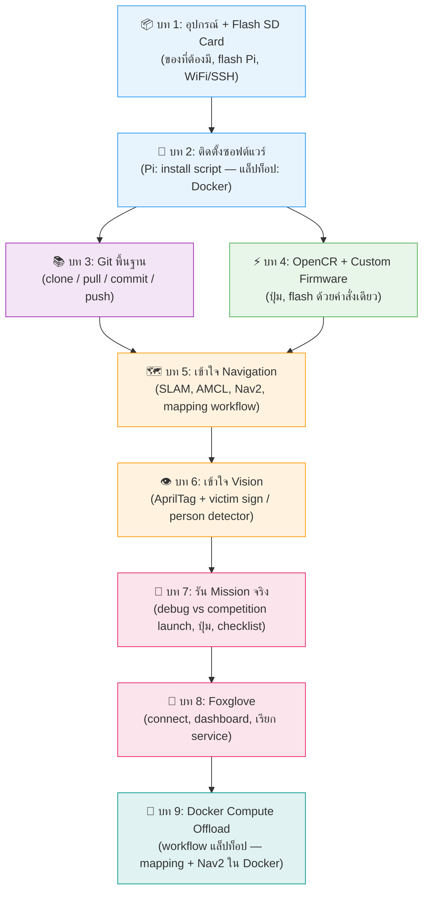

# RobotKub TurtleBot3 -- คู่มือเรียนรู้ (WRG Thailand 2026)

**[ English version ](../en/00-index.md)**

ยินดีต้อนรับ! ชุดเอกสารนี้เขียนขึ้นเพื่อพาไปทีละบท ตั้งแต่แกะกล่องฮาร์ดแวร์
จนถึงสั่งหุ่นวิ่งภารกิจจริงได้ครบ ไม่ต้องมีพื้นฐาน ROS2 มาก่อนก็อ่านตามได้

## เป้าหมายการเรียนรู้

อ่านจบชุดนี้แล้วควรจะ:

- [ ] ใช้ **git** เป็น (clone / pull / commit / push) พอดูแลโค้ดของทีมเองได้
- [ ] เข้าใจว่า **Navigation** (SLAM, AMCL, Nav2) ทำงานยังไง และโค้ดของเราต่อเข้าไปตรงไหน
- [ ] เข้าใจว่า **Vision** (อ่าน AprilTag, หา victim sign) ทำงานยังไง และจะไป tune ตรงไหน
- [ ] flash **firmware OpenCR** เป็น และเข้าใจว่าทำไมต้อง custom
- [ ] ใช้ **Foxglove** ดูสิ่งที่หุ่นเห็น และสั่งหุ่นจากแล็ปท็อปได้
- [ ] สั่ง **เดิน mission จบ end-to-end** ได้เอง ทั้งโหมด debug และโหมดแข่งจริง

## ลำดับการอ่าน

**ไม่รู้จะเริ่มตรงไหน?** เริ่มที่ [บท 1](01-hardware-setup.md) เลย บท 3 และ 4 อ่านก่อนหลังก็ได้ — บท 3 (git) ต้องอ่านเพื่อทำงานร่วมกับทีม, บท 4 (OpenCR) ต้องอ่านก่อนรันหุ่นจริง

## สารบัญ

| บท | เนื้อหา |
|---|---|
| [1. อุปกรณ์ + Flash SD Card + WiFi](01-hardware-setup.md) | ของที่ต้องมี, วิธี flash SD card ลง Raspberry Pi, ตั้งค่า WiFi/SSH ก่อนบูตครั้งแรก |
| [2. ติดตั้งซอฟต์แวร์](02-install.md) | รัน `install-humble-turtlebot3.sh` บน Pi (แล็ปท็อปใช้ Docker — ดูบท 9), ตั้งค่า `LDS_MODEL` ตาม lidar ที่มีจริง, build workspace |
| [3. Git พื้นฐาน](03-git-basics.md) | clone/pull/commit/push, workflow ที่ทีมใช้จริงกับ repo นี้ |
| [4. OpenCR + Custom Firmware](04-opencr.md) | OpenCR ทำอะไร, ทำไมต้อง flash custom firmware (ปุ่ม), flash ด้วยคำสั่งเดียว `flash_opencr.sh` |
| [5. เข้าใจ Navigation](05-navigation.md) | node/topic/TF, SLAM vs AMCL, Nav2, mapping workflow, mission_manager ต่อเข้ายังไง |
| [6. เข้าใจ Vision](06-vision.md) | อ่าน AprilTag + victim = **รูปคน** (MobileNet-SSD person detector), tests/CI |
| [7. รัน Mission จริง](07-run-mission.md) | debug vs competition launch, ปุ่ม start/e-stop/resume, ต่อ servo, checklist วันแข่ง |
| [8. Foxglove](08-foxglove.md) | connect visualizer, import dashboard, เรียก service, ดู mission state |
| [9. ย้ายภาระประมวลผลไปแล็ปท็อป (Docker)](09-compute-pc.md) | workflow แล็ปท็อป: mapping & Nav2 debug ผ่าน Docker (ไม่ต้องลง ROS2 native) |

## เอกสารอ้างอิงอื่นๆ ในโปรเจกต์นี้

- [`../../README.md`](../../README.md)  README หลักของ repo (สรุปสั้น, ไว้เปิดดูเร็วๆ)
- [`../../src/ttb3_bringup/README.md`](../../src/ttb3_bringup/README.md)  รายละเอียด launch argument ทั้งหมด + checklist ฮาร์ดแวร์
- [`../../maps/README.md`](../../maps/README.md)  เรื่อง map ที่ save ไว้
- คู่มือ TurtleBot3 ทางการ: <https://emanual.robotis.com/docs/en/platform/turtlebot3/overview/>

## Glossary (ศัพท์ที่เจอบ่อย)

| คำ | ความหมายง่ายๆ |
|---|---|
| Node | โปรแกรมเล็กๆ ที่ทำงานอย่างเดียว แล้วคุยกับตัวอื่นผ่าน topic |
| Topic | ช่องสัญญาณที่มีชื่อ ให้ node publish/subscribe เหมือนกลุ่มแชท |
| SLAM | สร้างแผนที่ไปพร้อมๆ กับหาว่าตัวเองอยู่ตรงไหนบนแผนที่ |
| AMCL | หาว่าตัวเองอยู่ตรงไหนบนแผนที่ที่มีอยู่แล้ว |
| Nav2 | วางเส้นทางและขับหุ่นไปถึงจุดหมาย หลบกำแพงเอง |
| AprilTag | ป้ายคล้ายบาร์โค้ด กล้องอ่านได้แม่นแม้มองเฉียง |
| E-stop | "หยุดฉุกเฉิน" — หยุดการเคลื่อนที่ทั้งหมดทันที (ปุ่ม SW2 บน OpenCR) |

ไม่แน่ใจว่าจะเริ่มตรงไหน? เริ่มที่ [บท 1](01-hardware-setup.md) เลยครับ
