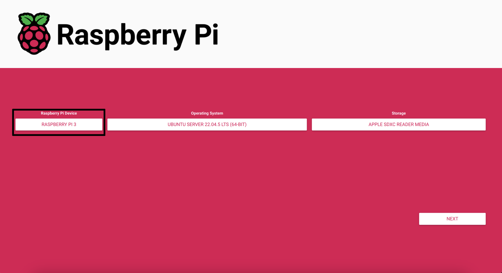
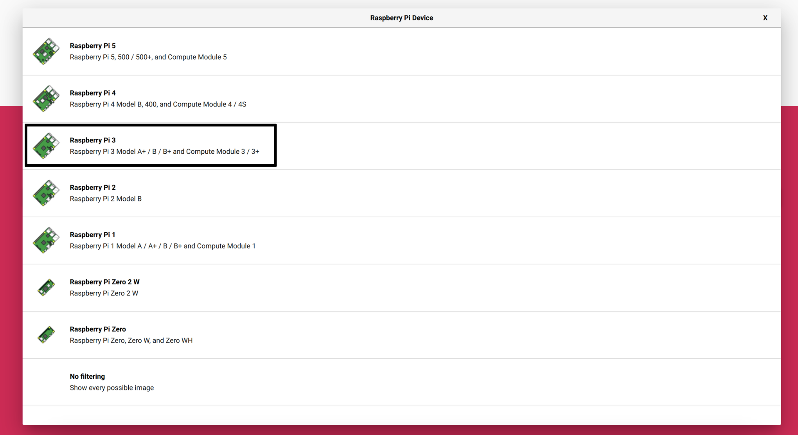
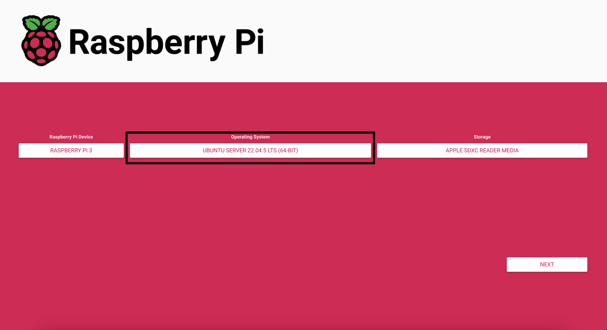
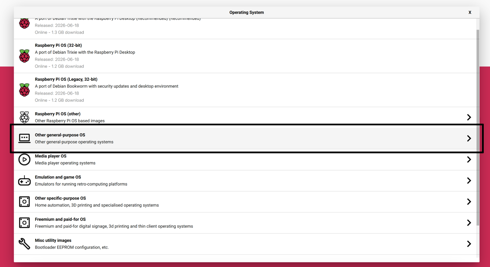
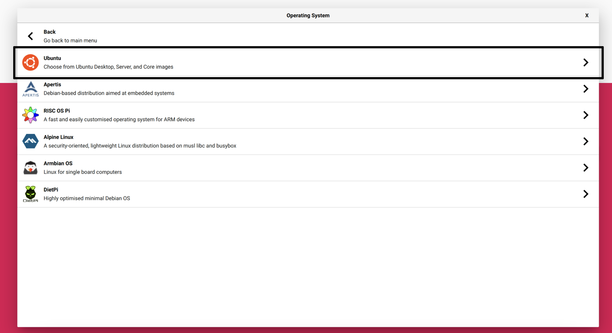
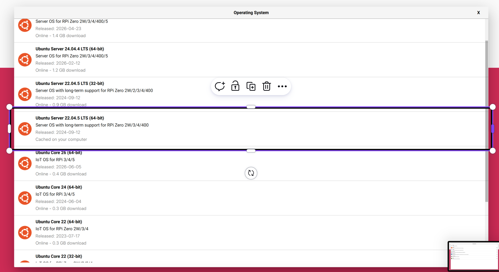
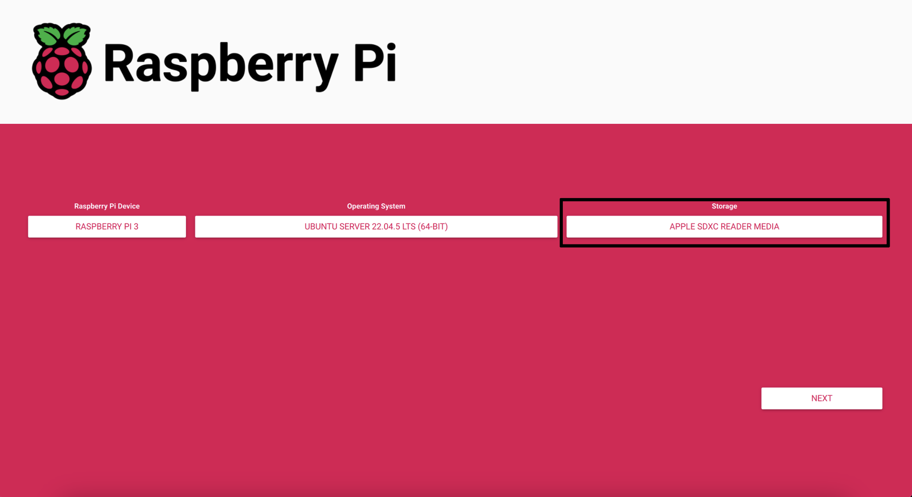
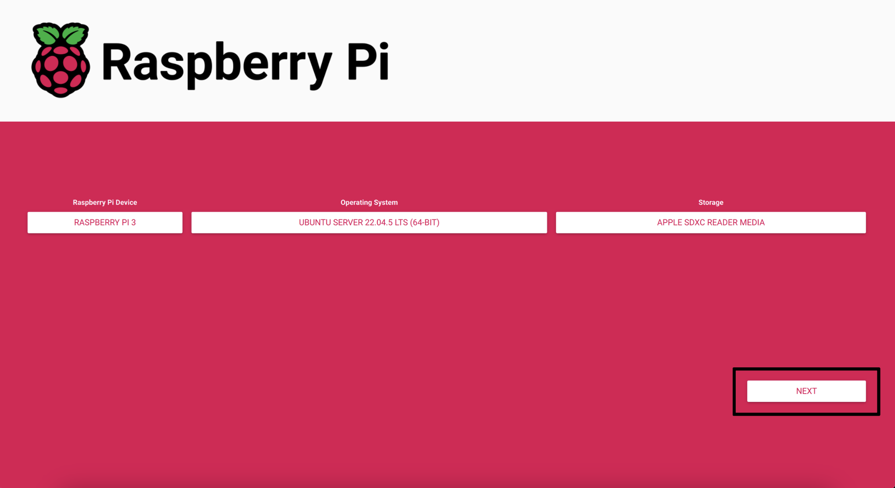
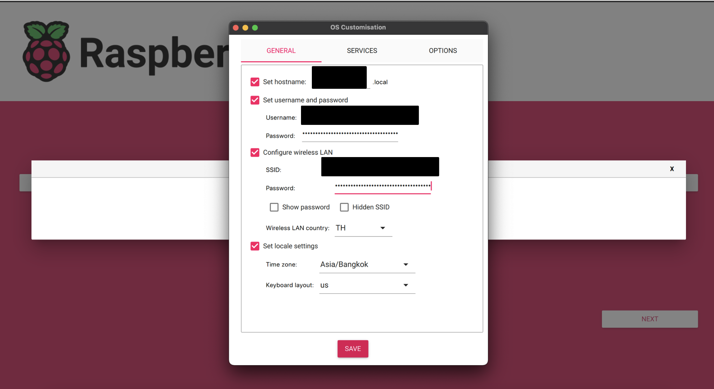
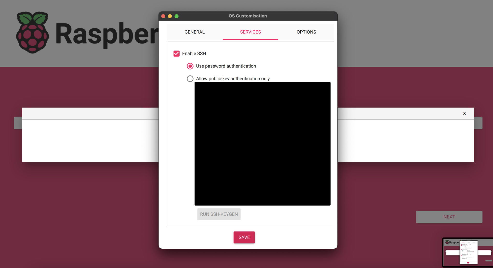

← [กลับสารบัญ](00-index.md) | ถัดไป: [2. ติดตั้งซอฟต์แวร์ →](02-install.md)

# 1. อุปกรณ์ที่ต้องมี + Flash SD Card + ตั้งค่า WiFi

## อุปกรณ์ที่ต้องมี

**ตัวหุ่น (TurtleBot3 Burger)**
- Raspberry Pi (SBC) + การ์ด micro SD (แนะนำ 32GB ขึ้นไป, class 10 หรือเร็วกว่า)
- OpenCR board
- มอเตอร์ DYNAMIXEL x2 (ล้อซ้าย/ขวา)
- Lidar -- โปรเจกต์นี้ใช้ **LDS-01** (ถ้าของทีมคุณเป็นรุ่นอื่น ดูหัวข้อ `LDS_MODEL` ใน [บท 2](02-install.md))
- กล้อง USB webcam
- แบตเตอรี่ + สาย USB จ่ายไฟ Pi
- กลไกดิสเพนเซอร์ (ตัวดีดกล่อง supply box) -- ยังไม่ fix ว่าจะต่อยังไง (Pi GPIO หรือผ่าน OpenCR) ดู checklist ใน [`src/ttb3_bringup/README.md`](../../src/ttb3_bringup/README.md) และคุยกับทีมก่อนต่อจริง

**ที่ต้องมีเพิ่ม**
- เครื่องอ่านการ์ด SD (SD card reader) ต่อกับคอม/แล็ปท็อป
- สาย Ethernet (ใช้ตอน debug mode -- ดู [บท 6](06-run-mission.md))
- WiFi router/access point ที่ทั้ง Pi และแล็ปท็อปต่อได้
- แล็ปท็อป (สำหรับลง ROS2 desktop, RViz2, Foxglove)

## วิธี Flash SD Card

ทำตามคู่มือทางการของ ROBOTIS เป๊ะๆ ได้เลย:
**<https://emanual.robotis.com/docs/en/platform/turtlebot3/sbc_setup/#sbc-setup>**

สรุปสั้นๆ (คู่มือทางการมีละเอียดกว่านี้ ถ้าติดตรงไหนให้เช็คที่ลิงก์ด้านบน):

1. โหลด **Raspberry Pi Imager** ที่เครื่องแล็ปท็อป: <https://www.raspberrypi.com/software/>
2. ใส่การ์ด SD เข้าเครื่องอ่าน
3. เปิด Raspberry Pi Imager จะเห็น 3 ช่องที่ต้องเลือก: **Raspberry Pi Device**, **Operating System**, **Storage**

   

4. กด **Raspberry Pi Device** แล้วเลือกรุ่นที่มีจริง (หุ่นของโปรเจกต์นี้ใช้ **Raspberry Pi 3**):

   

5. กด **Operating System**:

   

   เลือก **Other general-purpose OS** (ไม่ใช่ Raspberry Pi OS ที่เป็น default -- เราต้องการ Ubuntu):

   

   แล้วเลือก **Ubuntu**:

   

   แล้วเลือก **Ubuntu Server 22.04.5 LTS (64-bit)** -- ต้องเป็น 22.04 เพื่อให้ตรงกับ ROS2 Humble เท่านั้น อย่าเลือกเวอร์ชันใหม่กว่าหรือเก่ากว่านี้:

   

6. กด **Storage** แล้วเลือกการ์ด SD ที่เสียบไว้ (เช็คให้ชัวร์ว่าเลือกถูกอัน จะได้ไม่เผลอฟอร์แมตดิสก์อื่น):

   

7. ครบทั้ง 3 ช่องแล้ว กด **NEXT**:

   

## ตั้งค่า WiFi + SSH ก่อน Flash (สำคัญ -- ทำให้ไม่ต้องต่อจอ/คีย์บอร์ดเข้า Pi เลย)

กด Next แล้ว Imager จะถามว่าจะปรับ OS customisation ไหม -- เลือก **Edit Settings**
(หรือกด **ปุ่มเฟือง (⚙️)** / `Ctrl+Shift+X` ไว้ล่วงหน้าก็ได้) แล้วตั้งค่าในแท็บ **GENERAL**:

- **Set hostname**: ตั้งชื่อ Pi (เช่น `turtlebot3`) จะได้เรียก `turtlebot3.local` แทนจำ IP
- **Set username and password**: username/password ที่ทีมตกลงกัน
- **Configure wireless LAN**: ใส่ SSID + password ของ WiFi ที่จะใช้ และประเทศของ wireless LAN (`TH`)
- **Set locale settings**: เลือก timezone ให้ตรง (`Asia/Bangkok`)



แล้วสลับไปแท็บ **SERVICES** เปิด SSH:

- **Enable SSH**: ติ๊กเปิด แล้วเลือก **Use password authentication**



กด Save แล้วค่อยกด **Write** เพื่อ flash ลงการ์ด SD -- ตั้งค่าพวกนี้จะถูกฝังไปกับ image เลย
พอเสียบการ์ดใส่ Pi แล้วเปิดเครื่องครั้งแรก Pi จะต่อ WiFi เองและเปิด SSH รอไว้ให้ทันที
ไม่ต้องต่อจอ/คีย์บอร์ด/เมาส์เข้ากับ Pi เลย

> hostname/username/password/WiFi ที่ตั้งไว้ตรงนี้ อย่าเผลอเอาไปใส่ในสิ่งที่จะ
> commit ขึ้น public repo (อย่า paste ค่าจริงลงในเอกสาร, screenshot, หรือ commit message)

## เข้า Pi ครั้งแรก

รอ Pi บูตเสร็จ (ไฟ LED กระพริบสักพักแล้วนิ่ง ~1-2 นาที) แล้วหา IP:

```bash
ping turtlebot3.local   # ถ้าตั้ง hostname ไว้ตอน flash
# หรือเข้าหน้า admin ของ router ดูรายการอุปกรณ์ที่ต่อ WiFi
```

แล้ว SSH เข้าไปด้วย username/password ที่ตั้งไว้ตอน flash:

```bash
ssh <username>@<pi-ip-or-hostname>
```

เข้าได้แล้วก็เช็คพื้นฐานให้ชัวร์ก่อนไปต่อ:

```bash
lsb_release -a       # ต้องได้ Ubuntu 22.04
uname -m              # ต้องได้ aarch64 (arm64)
```

ผ่านแล้ว ไปต่อ [บท 2: ติดตั้งซอฟต์แวร์](02-install.md) ได้เลย

---
← [กลับสารบัญ](00-index.md) | ถัดไป: [2. ติดตั้งซอฟต์แวร์ →](02-install.md)
