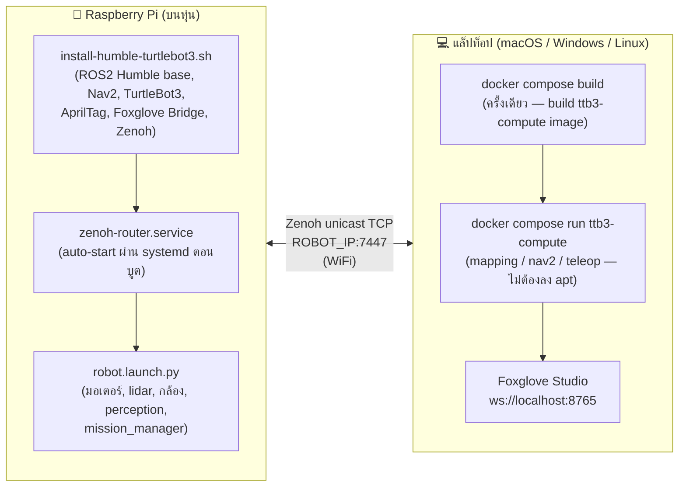

← [1. อุปกรณ์ + SD Card](01-hardware-setup.md) | [กลับสารบัญ](00-index.md) | ถัดไป: [3. Git พื้นฐาน →](03-git-basics.md)

# 2. ติดตั้งซอฟต์แวร์

## TL;DR — ใครทำอะไร

| เครื่อง | ต้องทำอะไร |
|---|---|
| **Raspberry Pi (หุ่นยนต์)** | รัน install script (ครั้งเดียว ตามขั้นตอนด้านล่าง) |
| **แล็ปท็อป** | **ไม่ต้องลงอะไรเลย** — ใช้ Docker แทน ดู [บท 9](09-compute-pc.md) |



สมาชิกทีมที่ใช้แล็ปท็อป **ไม่ต้องรัน** `install-humble-turtlebot3.sh`

Docker workflow (`docker compose build` + `docker compose run`) ให้ ROS2 Humble
environment ครบได้โดยไม่ต้องสู้กับ apt หรือดูแล ROS2 install บนเครื่องตัวเอง
ใช้ได้เหมือนกันทั้ง macOS, Windows และ Linux

---

## 2.1 รัน install script (บน Pi เท่านั้น)

```bash
git clone https://github.com/robotkub/turtlebot3.git ~/turtlebot3_ws
cd ~/turtlebot3_ws/scripts
chmod +x install-humble-turtlebot3.sh
./install-humble-turtlebot3.sh
```

(ยังไม่รู้จัก `git clone` ดีพอ? อ่าน [บท 3: Git พื้นฐาน](03-git-basics.md) ก่อนก็ได้ แล้วค่อยย้อนกลับมาทำขั้นนี้)

สคริปต์นี้ลงให้บน Pi ครบ: ROS2 Humble base, TurtleBot3 packages, Nav2, SLAM Toolbox,
slam_toolbox, AprilTag, Foxglove Bridge, Zenoh (`rmw_zenoh_cpp`) — แล้ว build workspace
ให้เลยรอบแรก บน **Pi** ยังลง servo library (`python3-gpiozero`, `python3-lgpio`)
สำหรับดิสเพนเซอร์ และตั้ง `LDS_MODEL` + alias ที่ใช้บ่อย (`reset_pose`, `estop`,
`foxglove_start`, `rebuild`) ใน `~/.bashrc` ให้ด้วย และยังติดตั้ง **zenoh router
เป็น systemd service** (`zenoh-router.service`) ให้พร้อมก่อน login ด้วย

> [!IMPORTANT]
> ทุกอย่างต้องพึ่ง zenoh router บน Pi เพื่อค้นหากัน บน Pi จัดการอัตโนมัติผ่าน
> systemd -- เช็คด้วย `systemctl status zenoh-router.service`
> Docker container บนแล็ปท็อปเชื่อมต่อผ่าน `ROBOT_IP=<ip ของ pi>` —
> ดู [บท 9](09-compute-pc.md)

**หลังรันเสร็จ**: ปิด terminal แล้วเปิดใหม่ (หรือ `source ~/.bashrc`) แล้วเช็ค:

```bash
echo $ROS_DISTRO         # -> humble
echo $TURTLEBOT3_MODEL    # -> burger
```

## 2.2 ตั้งค่า `LDS_MODEL` ตาม lidar ที่มีจริง (บน Pi เท่านั้น)

**สำคัญมาก** -- ถ้าข้ามขั้นนี้ พอต่อหุ่นจริง `robot.launch.py` จะ **crash ทันที**
(`KeyError: 'LDS_MODEL'`) เพราะมันอ่านตัวแปรนี้เพื่อเลือกว่าจะ launch driver
lidar ตัวไหน

เช็คก่อนว่า lidar ที่มีจริงเป็นรุ่นอะไร (ดูสติกเกอร์ใต้ตัว lidar หรือใบสเปคตอนซื้อ):

| รุ่น | ค่าที่ต้องตั้ง | driver ที่ใช้ |
|---|---|---|
| LDS-01 (ของโปรเจกต์นี้) | `LDS_MODEL=LDS-01` | `hls_lfcd_lds_driver` (มากับ apt แล้ว) |
| LDS-02 / LD08 | `LDS_MODEL=LDS-02` | `ld08_driver` (ต้อง clone+build เองจาก source, apt ไม่มี) |

install script ตั้ง `LDS_MODEL=LDS-01` ให้ใน `~/.bashrc` แล้ว ถ้าของทีมเป็นรุ่นอื่น
ให้แก้ (และถ้าเป็น LDS-02/LD08 ต้อง build `ld08_driver` จาก source เพิ่มด้วย):
```bash
grep LDS_MODEL ~/.bashrc          # เช็คว่ามีแล้ว
# ถ้าจะแก้ ให้แก้ใน ~/.bashrc แล้ว:
source ~/.bashrc
```

> ถ้าใช้ LDS-01 (ตามที่ทีมนี้ใช้อยู่) ไม่ต้องทำอะไรเพิ่มแล้ว เพราะ
> `ros-humble-turtlebot3-bringup` ดึง `hls_lfcd_lds_driver` มาให้อัตโนมัติผ่าน
> apt dependency อยู่แล้ว และ install script ตั้งตัวแปรให้แล้ว

## 2.3 ROS_DOMAIN_ID -- อย่าลืมก่อนวันแข่ง

`~/.bashrc` บน Pi (ตั้งโดย install script) มี `ROS_DOMAIN_ID=42`
Docker run บนแล็ปท็อปส่งค่าผ่าน `ROS_DOMAIN_ID=42 docker compose run ...`
(ดู [บท 9](09-compute-pc.md)) — **ทั้งสองต้องตรงกัน**
**ก่อนวันแข่งจริง ทุกคนในทีมต้องเปลี่ยนเป็นเลขที่ไม่ซ้ำใคร**
(แก้ใน `~/.bashrc` บน Pi และใช้เลขเดียวกันตอน `docker compose run` ด้วย)
เพราะสนามแข่งมี 6-7 ทีมใช้ WiFi router ตัวเดียวกัน ถ้าใช้เลข default เหมือนกัน
จะเห็นหุ่นทีมอื่นปนกับของตัวเอง

## 2.4 Build workspace ของเรา (บน Pi เท่านั้น)

ถ้ายังไม่ได้ build (หรือแก้โค้ดแล้วอยากลอง build ใหม่):

```bash
cd ~/turtlebot3_ws
colcon build
source install/setup.bash
```
(ไม่ใส่ `--symlink-install`: workspace นี้ build มาแบบไม่มี flag นี้ตั้งแต่แรก
ถ้าใส่ทีหลัง colcon จะพยายาม symlink ทับ directory ที่มีอยู่แล้วจริงๆจาก build
ครั้งก่อน แล้วจะ fail ถ้าอยากได้ symlink-install แบบ clean จริงๆ ให้ `rm -rf
build install log` ก่อน)

เช็คว่า package ของเราขึ้นครบ:
```bash
ros2 pkg list | grep ttb3
# ต้องเห็น: ttb3_bringup ttb3_dispenser ttb3_mission ttb3_msgs ttb3_perception
```

ครบแล้วไปต่อ [บท 3: Git พื้นฐาน](03-git-basics.md) ได้เลย

---
← [1. อุปกรณ์ + SD Card](01-hardware-setup.md) | [กลับสารบัญ](00-index.md) | ถัดไป: [3. Git พื้นฐาน →](03-git-basics.md)
