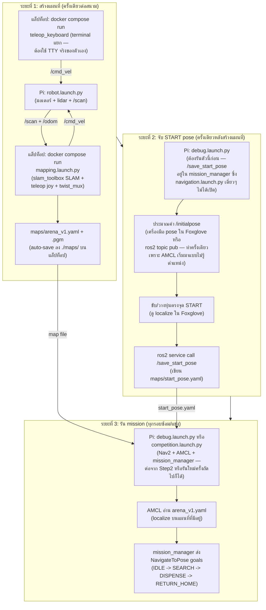

<- [4. OpenCR + Custom Firmware](04-opencr.md) | [กลับสารบัญ](00-index.md) | ถัดไป: [6. เข้าใจ Vision ->](06-vision.md)

# 5. เข้าใจ Navigation

## ศัพท์พื้นฐานก่อน

| คำ | ความหมายง่ายๆ |
| --- | --- |
| **Node** | โปรแกรมเล็กๆ หนึ่งตัว ทำงานหนึ่งอย่าง คุยกับตัวอื่นผ่าน topic |
| **Topic** | ช่องทางสื่อสารที่มีชื่อ (เช่น `/cmd_vel`) node ไหนจะ publish (พูด) หรือ subscribe (ฟัง) ก็ได้ |
| **TF** | ระบบบอกว่า "จุดนี้อยู่ตรงไหนเทียบกับจุดนั้น" เช่น กล้องอยู่ตรงไหนเทียบกับตัวหุ่น |
| **`/odom`** | ตำแหน่งหุ่นที่คำนวณจากล้อหมุนไปกี่รอบ (เพี้ยนสะสมได้ถ้าล้อลื่น) |
| **`/map`** | แผนที่ของสนามที่ build ไว้แล้ว |
| **SLAM** | สร้างแผนที่ + หาตำแหน่งตัวเองไปพร้อมกัน (ใช้ตอนยังไม่มีแผนที่) |
| **AMCL** | หาตำแหน่งตัวเองบนแผนที่ที่ **มีอยู่แล้ว** (เร็ว/แม่นกว่า SLAM ถ้าแผนที่ไม่เปลี่ยน) |
| **Nav2** | ระบบวางแผนเส้นทาง + ขับไปเอง หลบกำแพง เมื่อบอกพิกัดปลายทาง |

## Layer การทำงาน (จากล่างขึ้นบน)

1. **OpenCR firmware** — publish `/odom`, `/imu`, `/scan` (lidar), `/sensor_state`; subscribe `/cmd_vel`
2. **ROS2** — ระบบส่งข้อความกลางที่ทำให้ node ทุกตัวคุยกันได้
3. **Nav2 + SLAM/AMCL** — ของสำเร็จรูป (ไม่ได้เขียนเอง) ที่เรา config ให้ทำงานกับหุ่นเรา
4. **โค้ดของเรา** — `mission_manager` เป็นคนสั่ง Nav2 ว่า "ไปตรงนี้ที" ผ่าน action `NavigateToPose`

Layer 3 (ตัว Nav2 เอง) เป็นระบบย่อยที่ใหญ่มาก — costmap, planner, controller,
recovery behavior — คุยกันเองข้างในอีกที นี่คือ diagram สถาปัตยกรรมทางการจาก
[โปรเจกต์ Nav2](https://docs.nav2.org/) (เราไม่ได้ maintain Nav2 แค่ config เอา):


`config/nav2_params.yaml` ของเรา (หัวข้อปรับค่า Nav2 ด้านล่าง) คือตัวจูนกล่องต่างๆ
ใน diagram นี้ (costmap layers, planner/controller plugin) ให้เข้ากับหุ่นเรา

## ภาพรวม Navigation pipeline



## ขั้นตอนสร้างแผนที่ (ทำครั้งเดียวต่อสนามหนึ่งแบบ)

แค่ 2 คำสั่ง ไม่มี shell script แล้ว launch สร้างแผนที่จะ **auto-save แผนที่ลงดิสก์
เรื่อยๆ และเซฟอีกครั้งตอนกด Ctrl-C** ไม่ต้องมีขั้น "save" แยก: ขับสำรวจให้ทั่ว แล้ว
Ctrl-C ตอนแผนที่ดูครบ

> [!NOTE]
> **ไม่ต้องสั่งอะไรบน Pi** `ttb3-hardware.service` เปิดใช้แล้ว base, lidar,
> dispenser และลำโพงขึ้นเองตอนบูต — เสียบไฟหุ่นก็อยู่บน graph (ROS graph) เลย **อย่า**สั่ง
> launch ซ้ำเอง เพราะ `turtlebot3_node` ตัวที่สองจะแย่ง `/dev/ttyACM0` กับตัวแรก
> เช็คด้วย `systemctl status ttb3-hardware` และถ้าจะให้หุ่นเงียบใช้
> `sudo systemctl stop ttb3-hardware`

```bash
# terminal 2 (laptop) — SLAM (slam_toolbox) + Foxglove bridge + auto-saver
# + teleop joy (bundle มาให้เลย, รวมและจัดลำดับความสำคัญคำสั่ง ลง /cmd_vel ผ่าน twist_mux)
# คำสั่งแล็ปท็อปทั้งหมดรันใน Docker ไม่ต้องลง ROS2 บนเครื่อง
# ./ttb3 หาหุ่นด้วยชื่อ (skuba.local) และใส่ flag ที่ถ้าลืมแล้วพังเงียบๆ ให้อัตโนมัติ
./ttb3 map

# terminal 3 (laptop) — ขับด้วยคีย์บอร์ด ต้องแยก terminal จริงๆ เพราะ
# ros2 launch จัดการ child process ผ่าน pipe ไม่สามารถให้ TTY จริงกับ
# teleop_keyboard ได้ (ถ้าลอง bundle เข้า terminal 2 จะพังด้วย termios.error)
./ttb3 teleop
```
joy priority สูงกว่าคีย์บอร์ดถ้าใช้ทั้งคู่ (ผ่าน `twist_mux`)

เปิด Foxglove Studio ที่ `ws://localhost:8765` ดูแผนที่กำลังสร้าง
พอแผนที่ไม่มีส่วนดำ (unknown) เหลือในกำแพงแล้ว **Ctrl-C ที่ terminal 2** ได้เลย
`arena_v1.yaml` + `arena_v1.pgm` ถูกเซฟไว้ใน `./maps/` บนแล็ปท็อป
(volume mount เขียนลง host filesystem ตรงๆ)
auto-saver ยังเขียนทับให้ทุกๆ ~15 วิระหว่างรัน crash ก็ไม่เสียงาน

รายละเอียดเพิ่มเติม: [`../../maps/README.md`](../../maps/README.md)

## จับ START pose

START pose (จุดที่หุ่นเริ่มและกลับมา) อยู่ใน **ไฟล์เดียว**:
`maps/start_pose.yaml` ทุกอย่างอ่านจากไฟล์นี้ ตั้งครั้งเดียวพอ

`/save_start_pose` อยู่ใน `mission_manager` ซึ่งจะมีก็ต่อเมื่อรัน
`debug.launch.py` (หรือ `competition.launch.py`) เท่านั้น — **ไม่ใช่**
`navigation.launch.py` เดี่ยวๆ จากหัวข้อก่อนหน้า เพราะตัวนั้นไม่เปิด
`mission_manager` เลย ต้องเปิดสแต็กเต็มก่อน บน Pi:

```bash
ros2 launch ttb3_bringup debug.launch.py
```

AMCL เริ่มมาแบบไม่รู้ตำแหน่งหุ่นเลย ถ้าดูใน Foxglove แล้วแผนที่กับตำแหน่งหุ่นดูเพี้ยน
ให้ประมาณค่าคร่าวๆ ก่อน — จะใช้เครื่องมือ pose (ลูกศร) ใน 3D panel ของ Foxglove
ลากบนแผนที่ หรือใช้ CLI ก็ได้:

```bash
ros2 topic pub -1 /initialpose geometry_msgs/msg/PoseWithCovarianceStamped \
  '{header: {frame_id: "map"}, pose: {pose: {position: {x: 0.0, y: 0.0, z: 0.0}, orientation: {x: 0.0, y: 0.0, z: 0.0, w: 1.0}}}}'
```

แล้วขับ/วางหุ่นให้ตรงจุด START เป๊ะ เช็คว่า localize ดี (lidar ตรงกับแผนที่ใน Foxglove)
แล้วเรียก:

```bash
ros2 service call /save_start_pose ttb3_msgs/srv/SaveStartPose
```

คำสั่งนี้จะเขียนตำแหน่ง AMCL ปัจจุบันของหุ่นลง `maps/start_pose.yaml`
`mission_manager` อ่านไฟล์ใหม่ทุกครั้งที่ต้องใช้ START ค่าจึงมีผลทันที ไม่ต้อง rebuild
(จะแก้ไฟล์เองด้วยมือก็ได้) หลังจากนี้ `reset_to_start` จะ republish ค่าที่เซฟไว้ให้
อัตโนมัติ — การประมาณค่า `/initialpose` ด้วยมือข้างบนทำแค่ครั้งเดียวตอนแรก
(หรือทำใหม่ถ้า localize เพี้ยนหนักๆ ทีหลัง)

## ตอนรัน mission จริง — navigation ทำงานยังไง

`ttb3_bringup`'s `debug.launch.py`/`competition.launch.py` จะ include
`navigation.launch.py` ซึ่งเปิด Nav2 ทำงานกับแผนที่ที่เซฟไว้ (`maps/arena_v1.yaml`
เป็นค่า default, เปลี่ยนได้ด้วย `map:=...`) โหมดนี้ใช้ **AMCL** (ไม่ใช่ SLAM) เพราะ
มีแผนที่อยู่แล้ว ไม่ต้องสร้างใหม่ทุกรอบ

เปิด navigation เดี่ยวๆ เพื่อทดสอบ/tune ก็ได้:

```bash
# Docker บนแล็ปท็อป (ทางเดียวของแล็ปท็อป)
./ttb3 nav
```

### ปรับค่า Nav2

ไฟล์ param ที่ทีมปรับได้เป็นสำเนาในโปรเจกต์ที่
[`src/ttb3_bringup/config/nav2_params.yaml`](../../src/ttb3_bringup/config/nav2_params.yaml)
(โหลดเป็น default) แก้ที่ **ไฟล์นี้** ไม่ใช่ของ TurtleBot3 ต้นฉบับ ที่ปรับบ่อย: costmap
`inflation_radius` (เว้นห่างกำแพงแค่ไหน), controller max velocity (ความเร็ว), planner
tolerance หลังแก้ต้อง rebuild workspace ให้สำเนาที่ติดตั้งอัปเดต

## โค้ดของเราต่อเข้า Nav2 ตรงไหน

ไฟล์หลัก: `src/ttb3_mission/ttb3_mission/mission_manager.py`

- **IDLE**: บูตมาที่นี่ — พร้อมทำงานแต่ยังอยู่นิ่ง รอสัญญาณ start (ปุ่ม SW1 หรือ
  `/mission_start`) ก่อนถึงจะเริ่มขยับ
- **SEARCH**: ไปทีละโซนตามลำดับ (จาก `maps/mission_zones.yaml` — ดู
  [บท 7](07-run-mission.md)) ผ่าน action `NavigateToPose` ของ Nav2 ถึงโซนแล้วไม่เจอ
  อะไรก็ไปโซนถัดไป ถ้าเจอ tag หรือ victim จะปล่อยทันทีแล้วไปโซนถัดไปต่อ —
  กลับ `RETURN_HOME` ก็ต่อเมื่อไปครบทุกโซนแล้ว
- **RETURN_HOME**: ส่ง goal กลับไปที่ START pose (อ่านจาก `maps/start_pose.yaml`)
- **Stuck watchdog**: เช็ค `/odom` ว่าตำแหน่งขยับจริงไหมในช่วง 10 วินาทีล่าสุด
  ถ้าไม่ขยับเลย (ติดกำแพง/ล้อหมุนฟรี) จะยกเลิก goal แล้วหยุดแทนที่จะดันต่อไปเรื่อยๆ
- **`reset_to_start` service**: republish `/initialpose` กลับไปที่ START pose
  (แก้แค่ AMCL เชื่อว่าอยู่ตรงไหน ไม่ได้ลบคะแนน/ความคืบหน้า) เรียกจาก Foxglove, CLI
  หรือ alias `reset_pose` ได้

## ลองเล่นเอง

1. เปิด debug mode (`ros2 launch ttb3_bringup debug.launch.py`) แล้วดู `/mission_status` ใน Foxglove ว่า state เปลี่ยนยังไง
2. ลองสั่ง start มือ: `ros2 topic pub --once /mission_start std_msgs/msg/Empty "{}"`
3. ลองกด SW1/SW2 จริง (หรือ publish `/sensor_state` ปลอมด้วย `ros2 topic pub`) ดูว่า state เปลี่ยนตามที่คาดไหม

พร้อมแล้วไปต่อ [บท 6: เข้าใจ Vision](06-vision.md)

---
<- [4. OpenCR + Custom Firmware](04-opencr.md) | [กลับสารบัญ](00-index.md) | ถัดไป: [6. เข้าใจ Vision ->](06-vision.md)
