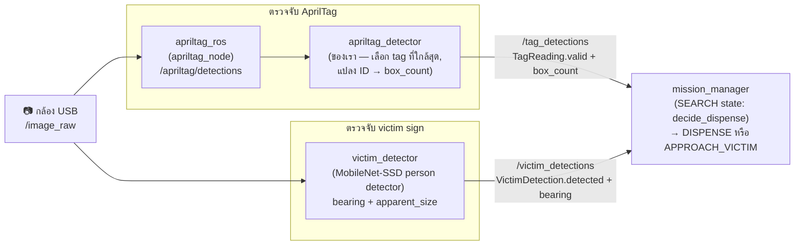

← [5. เข้าใจ Navigation](05-navigation.md) | [กลับสารบัญ](00-index.md) | ถัดไป: [7. รัน Mission จริง →](07-run-mission.md)

# 6. เข้าใจ Vision

หุ่นต้องมองเห็น 2 อย่าง: **ตัวเลขบน AprilTag** (จะได้รู้ว่าต้องดีดกล่องกี่ใบ)
กับ **victim sign** (ป้ายรูปคนที่ต้องไปยืนหน้าก่อนดีดกล่อง)

## ศัพท์พื้นฐาน

| คำ | ความหมายง่ายๆ |
|---|---|
| `/image_raw` | ภาพดิบจากกล้อง (frame ต่อ frame) |
| `/image_raw/compressed` | ภาพเดียวกัน แต่บีบอัดเป็น JPEG -- ใช้ตอนส่งผ่าน WiFi ไม่กิน bandwidth มาก |
| `/camera_info` | ค่า calibration ของกล้อง (เลนส์บิดแค่ไหน ฯลฯ) |
| AprilTag | ป้ายลายบาร์โค้ดขาวดำ กล้องอ่านได้แม่นแม้มองเฉียง |

## ภาพรวม Perception pipeline



ตัวอย่างที่ detector เห็น — จากชุดทดสอบ:

| AprilTag (ID 3 → ดีด 3 กล่อง) | Victim sign (รูปคน → ดีด 1 กล่อง) | ไม่ใช่คน (reject) |
|:---:|:---:|:---:|
|  |  |  |

## AprilTag -- อ่านตัวเลข

ไม่ได้เขียน detector เองทั้งหมด ใช้ของสำเร็จรูป `apriltag_ros` (ลงไว้แล้วผ่าน apt)
แล้วเราเขียน wrapper บางๆ คลุมอีกที:

```
กล้อง --/image_raw--> apriltag_ros (apriltag_node) --/apriltag/detections--> apriltag_detector (เราเขียน) --/tag_detections--> mission_manager
```

`apriltag_detector` (`src/ttb3_perception/ttb3_perception/apriltag_detector.py`) ทำแค่:
- เลือก tag ที่ใกล้ที่สุด (พื้นที่ใหญ่สุดในภาพ) ถ้าเห็นหลายอัน
- แปลง **tag ID เป็น box_count โดยตรง** (tag เลข 3 = ดีด 3 กล่อง) ปรับ offset/max ได้ที่ param
- ถ้าไม่เห็น tag เลยติดกัน ก็จะ publish `valid: false`

**ค่าที่ต้อง tune จริง**: `src/ttb3_perception/config/tags_36h11.yaml` -> `size:`
(ขนาดขอบดำของ tag จริง หน่วยเมตร วัดจากป้ายจริงแล้วใส่ให้ตรง มีผลกับความแม่นของ pose,
ไม่กระทบการอ่าน ID)

## Victim detector -- หา**รูปคน**

victim sign คือ **รูปคน** เราเลยตรวจจับมัน *ในฐานะคน* -- ไม่ใช่จับจากสี ใช้โมเดล
นิวรัลเน็ตเล็กๆ **MobileNet-SSD** (person/object detector) ผ่าน OpenCV `dnn`:

1. ส่งภาพจากกล้องเข้าโมเดล (`cv2.dnn`)
2. เลือกกล่อง **person** ที่มั่นใจสุดและเกิน `confidence_threshold`
3. คำนวณจากกล่องนั้น:
   - `bearing`: จุดกึ่งกลางกล่อง เทียบกับกึ่งกลางภาพ (ซ้าย/ขวา) -- ใช้เลี้ยวเข้าหา
   - `apparent_size`: พื้นที่กล่อง / พื้นที่ภาพ -- ใช้ประมาณระยะ (ใหญ่ = ใกล้)

ทำไมใช้ DNN ไม่ใช้สี? เพราะป้ายอาจไม่ได้เป็นสีตายตัว และโจทย์คือ "นี่คือคนไหม" ซึ่งตรงกับ
ตัวป้ายพอดี เราลองใช้ threshold สี และ HOG people-detector ของ OpenCV มาก่อน -- สีเปราะ
(ขึ้นกับแสง) ส่วน HOG (เทรนจากรูปถ่ายคนจริง) จับรูปคนการ์ตูนได้ไม่นิ่ง DNN จับป้ายการ์ตูนได้
แม่นและไม่หลอนกับสนาม/tag/พื้นหลัง

โค้ด: `src/ttb3_perception/ttb3_perception/victim_detector.py` (ฟังก์ชันตรวจจับล้วนๆ คือ
`detect_person` ใน `vision_core.py`) ไฟล์โมเดลอยู่ที่ `src/ttb3_perception/models/`
(MobileNet-SSD, VOC class `person`)

**ค่าที่ต้อง tune จริง**: `src/ttb3_perception/config/victim_detector.yaml` ->
`confidence_threshold` เพิ่มถ้าหลอน (false detection) ลดถ้าจับป้ายไม่เจอ -- ไม่มีสีให้ tune

## mission_manager ใช้ผลลัพธ์ยังไง

dispense ทริกทันทีจาก state `SEARCH` ตามสิ่งที่กำลังมองเห็น
(ดูตารางกฎเต็มได้ที่ [บท 7](07-run-mission.md)):

- **เห็น Tag**: ดีด `tag.box_count` กล่องทันที (ไม่ต้องขับเข้าใกล้ — tag
  ให้จำนวนกล่องแต่ไม่มีข้อมูล bearing/proximity ให้ servo)
- **เห็น Victim (ไม่มี tag)**: เข้า `APPROACH_VICTIM` — ตอน state นี้
  ใช้ `bearing`/`apparent_size` ควบคุม `/cmd_vel` โดยตรง (ไม่ต้องส่ง goal
  ให้ Nav2) หมุนเข้าหา + ขับเข้าใกล้จนกว่า `apparent_size` ถึงค่าที่กำหนด
  (`approach_close_size`) และอยู่กึ่งกลางภาพพอ (`approach_center_tolerance`)
  แล้วค่อยหยุดสั่งดีด 1 กล่อง
- ปรับค่าทั้งสองได้ที่ `config/mission_params.yaml`

## Tests / CI

ทุกครั้งที่ push จะรัน **vision tests** บน GitHub Actions
([`.github/workflows/vision-tests.yml`](../../.github/workflows/vision-tests.yml)):
ตัวอ่าน AprilTag ต้องได้เลขถูก และ victim detector ต้องเจอ **คน** ในรูปคนการ์ตูนหลายๆ รูป
(รูปอ้างอิงจริง + รูปที่ composite คนลงบนพื้นหลังหลากหลาย) โดย**ไม่**ไปหลอนกับฉากที่ไม่ใช่คน
(สนาม, tag, พื้นหลังเปล่า/มีสี) — และแต่ละรูปถูกสุ่มหมุน, เอียง, มองจากมุมกล้อง, และปรับแสง
(AprilTag ก็ทดสอบแบบเฉียงด้วย) เทสพวกนี้ไม่พึ่ง ROS (ใช้ OpenCV + numpy + pupil-apriltags)
เลยรันเร็วโดยไม่ต้องลง ROS ตัว logic อยู่ที่
[`vision_core.py`](../../src/ttb3_perception/ttb3_perception/vision_core.py)
รันในเครื่องเองได้:

```bash
pip install -r src/ttb3_perception/test/requirements-test.txt
pytest src/ttb3_perception/test/test_vision.py -v
```

## ลองเล่นเอง

1. เปิด debug mode แล้วดู `/image_raw` (และ `/victim_detections`) ใน Foxglove
2. ลอง publish ปลอม `/apriltag/detections` ด้วย `ros2 topic pub` ดูว่า
   `apriltag_detector` แปลงเป็น `box_count` ถูกไหม
3. ยกรูปคนการ์ตูน / ป้าย victim ให้กล้องเห็น แล้วดู `/victim_detections` เปลี่ยนเป็น `detected: true`

พร้อมแล้วไปต่อ [บท 7: รัน Mission จริง](07-run-mission.md)

---
← [5. เข้าใจ Navigation](05-navigation.md) | [กลับสารบัญ](00-index.md) | ถัดไป: [7. รัน Mission จริง →](07-run-mission.md)
