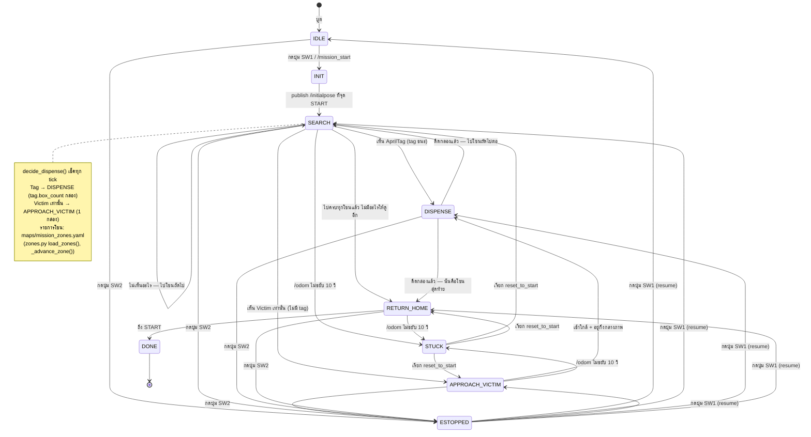

← [6. เข้าใจ Vision](06-vision.md) | [กลับสารบัญ](00-index.md) | ถัดไป: [8. Foxglove →](08-foxglove.md)

# 7. รัน Mission จริง

## debug.launch.py vs competition.launch.py

| | debug.launch.py | competition.launch.py |
|---|---|---|
| ใช้ตอน | ซ้อม/tune/debug | แข่งจริงเท่านั้น |
| ส่งภาพกล้องให้แล็ปท็อป? | ได้ (compressed) | ไม่ -- ปิดหมด |
| Foxglove? | เปิดได้ | ไม่เปิด |
| เครือข่าย | WiFi -- วิดีโอใช้ร่วมกับ navigation | WiFi -- เหลือให้ navigation อย่างเดียว |

**ห้ามซ้อมด้วยตัวแข่งจริง ห้ามแข่งด้วยตัว debug** -- เหตุผลคือการส่งภาพกิน
bandwidth WiFi ที่หุ่นต้องใช้ขับเอง ถ้าหลุดกลางทางหุ่นอาจ freeze ต้อง restart
(เสียแต้ม bonus)

## State machine ของ mission



## ซ้อม/ทดสอบวันนี้ (ยังไม่ได้ต่อ OpenCR/กล้องจริง)

> [!IMPORTANT]
> ตอนนี้สแต็กถูก **แบ่งเป็นสองเครื่อง** Pi รันแค่ driver ส่วนแล็ปท็อปคิดให้:
>
> ```bash
> ./ttb3 mission                                # บนแล็ปท็อป -- แค่นี้
> ```
>
> ครึ่งของ Pi ขึ้นเองตอนบูตแล้ว (`ttb3-hardware.service`) ไม่ต้องสั่งอะไรที่นั่น
> ถ้าจะสั่งเองคือ `ros2 launch ttb3_bringup hardware.launch.py` แต่ต้อง stop
> service ก่อน
>
> ให้รันแบบนี้ เพราะรันทั้งสแต็กบน Pi 3/4 ตัวเดียวมันตัน -- ตอนที่ Nav2, apriltag
> และ mission node รันพร้อมกัน Pi ยังตอบ ping อยู่แต่ `sshd` ทำ banner exchange
> ไม่จบแล้ว zenoh เป็นตัวเชื่อม graph ระหว่างสองเครื่อง ปุ่ม SW1/SW2 ยังสั่ง
> start/e-stop ได้เหมือนเดิม และภาพจากกล้องวิ่งข้าม WiFi แบบ compressed แล้วมา
> decode ฝั่งแล็ปท็อป
>
> คำสั่งแบบรวมบน Pi ข้างล่างยังใช้ได้อยู่ -- มันคือสองครึ่งนี้ประกอบกัน -- และอะไรที่
> ขึ้นต้นด้วย `ros2 launch` รันบน Pi (`ssh skuba@skuba.local`) เพราะแล็ปท็อปไม่มี
> `ros2` บนเครื่อง

ถ้ายังไม่ได้ประกอบฮาร์ดแวร์ครบ ทดสอบซอฟต์แวร์อย่างเดียวได้:

```bash
# บน Pi
ros2 launch ttb3_bringup debug.launch.py with_robot_base:=false with_camera:=false
```

จะได้ Nav2 + mission node ทั้ง 5 ตัว (dispenser เป็น mock) + Foxglove bridge
ขึ้นมาครบ ทดสอบว่าทุกอย่าง wiring ถูกก่อนประกอบหุ่นจริง

## ต่อฮาร์ดแวร์ครบแล้ว รันจริง

```bash
# บน Pi -- ซ้อม/tune
ros2 launch ttb3_bringup debug.launch.py

# บน Pi -- แข่งจริง
ros2 launch ttb3_bringup competition.launch.py
```

argument อื่นที่ปรับได้ (map, params_file, use_mock_hardware ฯลฯ) ดูตาราง
เต็มได้ที่ [`../../src/ttb3_bringup/README.md`](../../src/ttb3_bringup/README.md)

## เริ่ม / หยุด / ทำต่อ -- ปุ่ม

หุ่นบูตมาที่ **IDLE**: พร้อมทำงานแต่จะไม่ขยับจนกว่าจะสั่ง ควบคุมด้วยปุ่ม OpenCR 2 ปุ่ม
(ต้องใช้ custom firmware จาก [บท 4](04-opencr.md) -- ถ้าเป็น firmware มาตรฐานหุ่นจะ
test-drive แทน):

| ปุ่ม | ตอน | ทำอะไร |
|---|---|---|
| **SW1** | ที่ IDLE | **START** เริ่ม mission |
| **SW1** | หลัง e-stop | **RESUME** (เคลียร์ e-stop) |
| **SW2** | เมื่อไหร่ก็ได้ | **E-STOP** -- หยุดทันที ยกเลิก navigation |

การ re-localize กลับ START ไม่ใช่ปุ่มแล้ว -- เป็น service `/reset_to_start` (เรียกจาก
CLI, alias `reset_pose`, หรือ panel Service Call ใน Foxglove -- ดู [บท 8](08-foxglove.md))

ตอน bench-test ไม่มีปุ่ม สั่ง start มือได้:

```bash
ros2 topic pub --once /mission_start std_msgs/msg/Empty "{}"
```

## กฎการดีดกล่อง — อะไรทริกอะไร

จาก state `SEARCH`, `mission_manager` เช็คทุก tick ว่ามีการตรวจพบอะไรหรือไม่
**ทันที** (ไม่มีการรอให้เห็นทั้งคู่พร้อมกัน):

| สิ่งที่เห็น | State ถัดไป | กล่องที่ดีด |
|---|---|---|
| **AprilTag** (valid) | `DISPENSE` โดยตรง | `tag.box_count` (เลข ID ของ tag) |
| **Victim sign** (รูปคน, ไม่มี tag) | `APPROACH_VICTIM` → `DISPENSE` | **1 กล่อง** (หลังขับเข้าใกล้) |
| ไม่เห็นอะไรเลย | อยู่ใน `SEARCH` ต่อ | — (ไปโซนถัดไป) |

Tag มีลำดับความสำคัญสูงกว่า victim ถ้าเห็นทั้งคู่พร้อมกัน (ตามทฤษฎีไม่ควรเกิดจาก
layout สนาม แต่ logic เป็น deterministic)

การดีดไม่ได้จบ run ทันที `mission_manager` จะไปทุกโซนที่อยู่ใน
`maps/mission_zones.yaml` ตามลำดับ (ดู [บท 5](05-navigation.md)) -- ถึงโซนแล้ว
ไม่เจออะไรก็ไปโซนถัดไป ดีดกล่องแล้วก็ไปโซนถัดไปเหมือนกัน จะกลับ `RETURN_HOME`
ก็ต่อเมื่อไปครบทุกโซนแล้วเท่านั้น

### บันทึกโซนจาก Foxglove

ไม่ต้องพิมพ์พิกัดลง `maps/mission_zones.yaml` เองแล้ว `zone_recorder` เปิดมาพร้อม
ทั้ง `navigation.launch.py` และ `debug.launch.py` ดังนั้นแค่รัน `./ttb3 nav` ก็พอ:

ขับหุ่นไปจอดตรงจุดที่ต้องการ แล้วกด **"Save mission point (robot here)"** ซึ่งจะ
บันทึก `/amcl_pose` สดๆ พร้อมทิศทาง -- ทิศทางนี่แหละที่โซนต้องใช้ เพราะหุ่นต้อง
*หัน*ไปทาง tag หรือป้าย victim

โซนจะต่อท้ายไปเรื่อยๆ ตามลำดับที่บันทึก ซึ่งก็คือลำดับที่หุ่นจะไปเยือน
ถ้าอยากเริ่มใหม่ใช้ `ros2 service call /clear_zones std_srvs/srv/Trigger`
service รับ `{source: 'click', yaw: ...}` เพื่อใช้จุดที่คลิกบนแผนที่ได้ด้วย แต่ไม่มีปุ่มให้
เพราะจุดที่คลิกไม่มีทิศทางติดมา
`mission_manager` อ่านไฟล์นี้ **ตอนเริ่มทำงาน** ดังนั้นต้อง restart ก่อนโซนใหม่จะมีผล

## เปิด Foxglove ดูหุ่น

Foxglove มีบทของตัวเองแล้ว -- ดู **[บท 8: Foxglove](08-foxglove.md)** สำหรับวิธี
connect, import layout, และเรียก service ฉบับย่อ: bridge เปิดพร้อม `debug.launch.py`
เปิด <https://app.foxglove.dev> แล้ว connect ไปที่ `ws://<PI_IP>:8765`

โปรเจกต์นี้ใช้ Foxglove เป็น visualizer ตัวเดียว **ห้ามเปิด Foxglove ตอนแข่งจริง**
(ดูตารางด้านบน)

## ต่อ servo ดิสเพนเซอร์

ดิสเพนเซอร์เป็น servo ต่อกับ **GPIO ของ Pi** (ไม่ใช่ OpenCR) กติกามุม: **0° = hold**
(ปิดประตู กักลูกบาศก์), **180° = shoot** (ยิงออก 1 ลูก) หนึ่งกล่อง = หนึ่งรอบ hold→shoot→hold

| สาย servo | ต่อเข้า Pi | หมายเหตุ |
|---|---|---|
| Signal (มักส้ม/ขาว) | **GPIO18 = physical pin 12** | ขา hardware-PWM เปลี่ยนได้ด้วย param `gate_pin` |
| Power (แดง) | 5 V (physical pin 2 หรือ 4) | SG90 ตัวเล็กจ่ายจาก Pi ได้ servo ตัวใหญ่ต้องใช้ **แหล่งจ่าย 5 V แยก** |
| Ground (น้ำตาล/ดำ) | GND (physical pin 6) | ถ้าใช้ 5 V แยก ต้องต่อ GND ของมันเข้ากับ GND ของ Pi (common ground) |

แล้วสลับดิสเพนเซอร์เป็นฮาร์ดแวร์จริง: `use_mock_hardware:=false` (มุมและ timing อยู่ที่
param `hold_angle` / `shoot_angle` / `settle_time_sec` -- ดู
[bringup README](../../src/ttb3_bringup/README.md))

## Checklist ก่อนวันแข่ง

- [ ] `ROS_DOMAIN_ID` เปลี่ยนเป็นเลขไม่ซ้ำใครแล้ว (ดู [บท 2](02-install.md) หัวข้อ ROS_DOMAIN_ID)
- [ ] flash custom OpenCR firmware แล้ว ให้ SW1/SW2 ไม่ test-drive หุ่น ([บท 4](04-opencr.md))
- [ ] มีแผนที่สนามจริงที่ save ไว้แล้ว (`maps/arena_v1.yaml`) ไม่ใช่ placeholder
- [ ] จับ START pose ด้วย `/save_start_pose` แล้ว (ขับไป START แล้วเรียก) -- `maps/start_pose.yaml` เป็นค่าจริง ไม่ใช่ default
- [ ] โซนใน `maps/mission_zones.yaml` ตรงกับตำแหน่ง tag/victim จริงในสนาม
- [ ] victim sign (รูปคน) ถูกตรวจจับได้ชัวร์ -- ปรับ `confidence_threshold` ใน `config/victim_detector.yaml` ถ้าจำเป็น
- [ ] วัดขนาด AprilTag จริงแล้วใส่ใน `config/tags_36h11.yaml`
- [ ] ต่อ servo เข้า GPIO18, ปิด `use_mock_hardware`, เช็คมุม hold/shoot ให้ยิงออกพอดี 1 ลูก
- [ ] ทดสอบปุ่ม SW1 (start/resume) / SW2 (e-stop) กับฮาร์ดแวร์จริงแล้ว
- [ ] รัน `competition.launch.py` ทดสอบเต็มรอบอย่างน้อย 1 ครั้งก่อนแข่งจริง

ครบทุกข้อ พร้อมแข่งแล้วครับ! กลับไปดูสารบัญได้ที่ [`00-index.md`](00-index.md)

---
← [6. เข้าใจ Vision](06-vision.md) | [กลับสารบัญ](00-index.md) | ถัดไป: [8. Foxglove →](08-foxglove.md)
