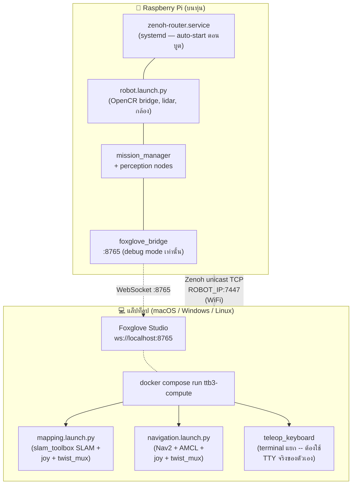

← [8. Foxglove](08-foxglove.md) | [กลับหน้าสารบัญ](00-index.md)

# 9. ย้ายภาระประมวลผลไปแล็ปท็อป (Docker — ทางเดียวของแล็ปท็อป)

Raspberry Pi 3 B+ (quad-core ARM Cortex-A53 @ 1.4 GHz, 1 GB RAM) บนหุ่นยนต์มีทรัพยากรจำกัด แม้จะคุมมอเตอร์ อ่านเซนเซอร์ รัน perception และภารกิจหลักได้ดี แต่การรัน SLAM (slam_toolbox) และ Nav2 localization/planning หนักๆ ไปพร้อมกันขณะสร้างแผนที่หรือทดสอบจูนระบบอาจสร้างภาระให้เครื่องมากเกินไป

สมาชิกทีมที่ใช้แล็ปท็อปย้ายการประมวลผลนี้มารันใน Docker container — **ไม่ต้องลง
ROS 2 บนเครื่องแล็ปท็อปเลย** Docker ทำให้ workflow ไม่ขึ้นกับ OS: คำสั่งเดียวกัน
ใช้ได้บน macOS, Windows และ Linux ทำให้ไม่ต้องสู้กับ apt หรือดูแล ROS2 install
บนเครื่องของตัวเอง

> [!IMPORTANT]
> **สำหรับโหมด Debug/Testing เท่านั้น!**
> การย้ายการประมวลผลนี้ใช้สำหรับ **การสร้างแผนที่ (mapping) การจูน และการทดสอบ debug เท่านั้น** ในวันแข่งจริง `competition.launch.py` จะรันบน Raspberry Pi แบบ standalone เต็มรูปแบบ โดยไม่ต้องพึ่งพาแล็ปท็อป (ตรงตามข้อกำหนด SRS R10 / N3/N4 เรื่องแบนด์วิดธ์ WiFi ในสนามแข่ง)

---

## สถาปัตยกรรมระบบ (Architecture)

- **อุปกรณ์กายภาพ**: มี 2 เครื่อง คือ Raspberry Pi (บนหุ่น) + แล็ปท็อป
- **สภาพแวดล้อมบนแล็ปท็อป**: รัน ROS 2 Humble ผ่าน Docker container (`ttb3-compute`) **ไม่ต้องติดตั้ง ROS 2 แบบ bare-metal บนแล็ปท็อปเลย**
- **การเชื่อมต่อเครือข่าย**: ใช้ **Zenoh** (`rmw_zenoh_cpp`) ไม่ใช่ CycloneDDS Zenoh router รันบน Pi; container บนแล็ปท็อปเชื่อมต่อผ่าน **unicast TCP** (`ROBOT_IP:7447`) ไม่ใช่ multicast discovery
  > [!IMPORTANT]
  > เราเปลี่ยนมาจาก CycloneDDS เพราะ UDP multicast discovery ของมันไม่ทำงานผ่าน Docker Desktop บน Mac/Windows — `network_mode: host` ที่นั่นไม่ใช่ host network จริง (Docker Desktop รัน container อยู่ใน VM) ทำให้ multicast ไม่ถึงหุ่นแม้ดูเหมือนจะถึง Zenoh ใช้ unicast connect แบบ explicit แก้ปัญหานี้ได้ ดู `docker/zenoh_client_config.json5.template`
- **การแสดงผล (Visualization)**: ใช้ Foxglove Bridge (`visualize:=true`) ที่ถูกรวมอยู่ใน launch file (เชื่อมต่อ WebSocket ที่ `ws://localhost:8765`) เป็น visualizer ตัวเดียวที่โปรเจกต์นี้ใช้



---

## การเตรียมระบบครั้งแรก (One-Time Setup)

export `ROS_DOMAIN_ID` กับ `ROBOT_IP` ก่อน ใน shell เดียวกันที่จะรันคำสั่ง
`docker compose` ทุกคำสั่งต่อจากนี้ -- `docker-compose.yml` ต้องใช้ `ROBOT_IP`
ตั้งแต่ parse ไฟล์เลย ดังนั้น `build` ก็ต้องมีตัวแปรนี้ด้วย ไม่ใช่แค่ `run`
(ถ้า `build` ไม่มี ROBOT_IP จะ fail ด้วย "required variable ROBOT_IP is
missing a value" และถ้าพลาดจุดนี้ image จะไม่ถูก rebuild แบบเงียบๆ -- รัน
`run` ต่อไปจะใช้ image เก่าแทน ไม่ fail ให้เห็นชัดๆ):

```bash
export ROS_DOMAIN_ID=42
export ROBOT_IP=<ip ของ Pi>
```

แล้วค่อยสั่ง build Docker image สำหรับประมวลผลบนแล็ปท็อป (รันจากโฟลเดอร์หลักของโปรเจกต์
รันใหม่ทุกครั้งหลัง pull โค้ดใหม่):

```bash
docker compose build
```

ระบบจะทำการคอมไพล์ `ttb3_bringup` ภายในภาพ ROS 2 Humble headless ที่ติดตั้ง slam_toolbox, Nav2, Foxglove Bridge, TurtleBot3 teleop และ Zenoh ไว้อย่างครบถ้วน

---

## ขั้นตอนการทำงานที่ 1: การสร้างแผนที่ (slam_toolbox + Map Autosaver)

1. **บน Raspberry Pi**: สั่งเปิดระบบฐานหุ่นยนต์ (OpenCR bridge & Lidar) Zenoh router รันอัตโนมัติผ่าน systemd ไม่ต้องสั่งเอง:
   ```bash
   ros2 launch turtlebot3_bringup robot.launch.py
   ```

2. **บนแล็ปท็อป**: สั่งรัน slam_toolbox mapping ผ่าน Docker (ใช้ `ROS_DOMAIN_ID`/`ROBOT_IP` ที่ export ไว้ตอนเตรียมระบบด้านบน -- ถ้าเป็น shell ใหม่ต้อง export อีกครั้ง):
   ```bash
   docker compose run --rm --service-ports ttb3-compute \
     ros2 launch ttb3_bringup mapping.launch.py map_path:=arena_v1 visualize:=true
   ```

3. **ดูผลลัพธ์และบังคับหุ่น**:
   - เปิด Foxglove Studio (`ws://localhost:8765`) เพื่อดูแผนที่กำลังสร้างแบบ real-time
   - จอยสติ๊ก/เกมแพดเปิดมาให้อัตโนมัติใน `mapping.launch.py` (เฉพาะเครื่อง Linux -- Docker Desktop บน Mac/Windows ไม่ pass-through `/dev/input`) arbitrate ลง `/cmd_vel` ผ่าน `twist_mux`
   - ถ้าจะขับด้วยคีย์บอร์ด ให้รัน `teleop_keyboard` ใน **terminal แยกของตัวเอง** -- มันต้องคุม TTY จริงเพื่ออ่านปุ่มกด และ `ros2 launch` ให้ TTY จริงกับ child process ที่ bundle เข้าไปไม่ได้ (ยืนยันแล้ว: ถ้าลอง bundle จะพังด้วย `termios.error`):
     ```bash
     docker compose run --rm ttb3-compute ros2 run turtlebot3_teleop teleop_keyboard \
       --ros-args -r cmd_vel:=cmd_vel_teleop
     ```
     (`stdin_open: true` / `tty: true` ใน `docker-compose.yml` ส่งปุ่มแป้นพิมพ์ให้ process นี้โดยตรง ถ้าใช้ทั้งคู่ joy priority จะสูงกว่าคีย์บอร์ด)
   - เมื่อสร้างแผนที่เสร็จแล้ว ให้กด `Ctrl-C` ที่เทอร์มินัล mapping ไฟล์แผนที่ (`arena_v1.pgm` และ `arena_v1.yaml`) จะถูกบันทึกลงในโฟลเดอร์ `./maps/` บนเครื่องแล็ปท็อปโดยอัตโนมัติผ่าน volume mount (`./maps:/maps`)

---

## ขั้นตอนการทำงานที่ 2: การทดสอบ Nav2 Standalone & Tuning

สำหรับการทดสอบและจูน Nav2 (AMCL + Path Planner) กับแผนที่ที่บันทึกไว้:

1. **บน Raspberry Pi**: สั่งเปิดระบบฐานหุ่นยนต์ Zenoh router รันอัตโนมัติผ่าน systemd:
   ```bash
   ros2 launch turtlebot3_bringup robot.launch.py
   ```

2. **บนแล็ปท็อป**: สั่งรัน Nav2 standalone ใน Docker:
   ```bash
   ROS_DOMAIN_ID=42 ROBOT_IP=<ip ของ Pi> docker compose run --rm --service-ports ttb3-compute \
     ros2 launch ttb3_bringup navigation.launch.py visualize:=true
   ```

3. **แสดงผลและกำหนดจุดเป้าหมาย**:
   - เชื่อมต่อ Foxglove ไปที่ `ws://localhost:8765`
   - กำหนด 2D Pose Estimate และ Nav Goal ผ่าน Foxglove
   - teleop joy ก็ bundle มาใน `navigation.launch.py` ด้วย โดย arbitrate กับ output ของ Nav2 ผ่าน `twist_mux` (priority: joy > คีย์บอร์ด > Nav2) -- คีย์บอร์ดต้องรันแยก terminal เหมือนขั้นตอนที่ 1 -- บังคับหุ่นเองได้ทุกเมื่อเพื่อ override Nav2 เช่นตอนหุ่นติด recovery

---

## ข้อกำหนดสำคัญและการตั้งค่า

- **`ROS_DOMAIN_ID`**: ต้องตรงกันระหว่าง Raspberry Pi และแล็ปท็อป (ค่าเริ่มต้นคือ `42`) ตั้งค่าผ่าน environment variable ก่อนสั่ง `docker compose run`
- **`ROBOT_IP`**: จำเป็นต้องมี — IP ปัจจุบันของ Pi เพื่อให้ zenoh session ของ container เชื่อมต่อ (unicast TCP) ไปยัง router บน Pi ได้
- **DDS Middleware**: ใช้ `rmw_zenoh_cpp` ตรงกันทั้งสองฝ่าย Router รันบน Pi เป็น systemd service (`zenoh-router.service`, ติดตั้งโดย `install-humble-turtlebot3.sh`) เช็คด้วย `systemctl status zenoh-router.service` manual start (`zenoh_router_start`) ยังมีสำหรับ debug
- **Host Volume Mounting**: โฟลเดอร์ `./maps` บนแล็ปท็อปถูกผูกกับ `/maps` ใน container ทำให้แผนที่ที่เซฟได้อยู่บนดิสก์ของเครื่องแล็ปท็อปทันที

---

← [8. Foxglove](08-foxglove.md) | [กลับหน้าสารบัญ](00-index.md)
